``` r
suppressPackageStartupMessages({
  library(readr)
  library(dplyr)
  library(tidyr)
  library(ggplot2)
  library(sf)
  library(rnaturalearth)

  library(GenomicRanges)
  library(ggbio)
  library(plyranges)
})
#> Warning: package 'GenomeInfoDb' was built under R version 4.3.3

source(here::here("utils.R"))
```

``` r
# IBDmix desert coordinates from Table S8 of Chan et al., 202 ---------------------------------
# (https://ars.els-cdn.com/content/image/1-s2.0-S0092867420300593-mmc1.pdf)
# (https://ars.els-cdn.com/content/image/1-s2.0-S0092867420300593-figs4_lrg.jpg)

deserts_df <- tribble(
  ~chrom, ~start_ss, ~end_ss,   ~start_ibdmix, ~end_ibdmix,
  "chr1", 102200000, 114900000, 105400000,     120600000,
  "chr3", 76500000,  90500000,  74100000,      89300000,
  "chr7", 106300000, 124700000, 106200000,     123200000,
  "chr8", 53900000,  66000000,  49400000,      66500000
) %>% pivot_longer(cols = c(starts_with("start_"), starts_with("end_")),
                   names_to = c(".value", "method"), names_sep = "_")
```

``` r
# combined Neanderthal and Denisovan deserts
# (https://www.science.org/doi/suppl/10.1126/science.aad9416/suppl_file/vernot-sm.pdf)
ss2_deserts_gr <- tribble(
  ~chrom, ~start, ~end,
  "chr1", 104000000, 114900000,
  "chr3", 76500000, 90500000,
  "chr7", 113600000, 124700000,
  "chr8", 54500000, 65400000
) %>% makeGRangesFromDataFrame()
```

``` r
ss_deserts_gr <- filter(deserts_df, method == "ss") %>% makeGRangesFromDataFrame()
ibdmix_deserts_gr <- filter(deserts_df, method == "ibdmix") %>% makeGRangesFromDataFrame()
deserts_gr <- pintersect(ss_deserts_gr, ibdmix_deserts_gr)
deserts2_gr <- pintersect(ss2_deserts_gr, ibdmix_deserts_gr)

ss_deserts_gr$width <- width(ss_deserts_gr) / 1e6
ss2_deserts_gr$width <- width(ss2_deserts_gr) / 1e6
ibdmix_deserts_gr$width <- width(ibdmix_deserts_gr) / 1e6
deserts_gr$width <- width(deserts_gr) / 1e6
deserts2_gr$width <- width(deserts2_gr) / 1e6
```

``` r
ss_deserts_gr
#> GRanges object with 4 ranges and 1 metadata column:
#>       seqnames              ranges strand |     width
#>          <Rle>           <IRanges>  <Rle> | <numeric>
#>   [1]     chr1 102200000-114900000      * |      12.7
#>   [2]     chr3   76500000-90500000      * |      14.0
#>   [3]     chr7 106300000-124700000      * |      18.4
#>   [4]     chr8   53900000-66000000      * |      12.1
#>   -------
#>   seqinfo: 4 sequences from an unspecified genome; no seqlengths
ss2_deserts_gr
#> GRanges object with 4 ranges and 1 metadata column:
#>       seqnames              ranges strand |     width
#>          <Rle>           <IRanges>  <Rle> | <numeric>
#>   [1]     chr1 104000000-114900000      * |      10.9
#>   [2]     chr3   76500000-90500000      * |      14.0
#>   [3]     chr7 113600000-124700000      * |      11.1
#>   [4]     chr8   54500000-65400000      * |      10.9
#>   -------
#>   seqinfo: 4 sequences from an unspecified genome; no seqlengths
ibdmix_deserts_gr
#> GRanges object with 4 ranges and 1 metadata column:
#>       seqnames              ranges strand |     width
#>          <Rle>           <IRanges>  <Rle> | <numeric>
#>   [1]     chr1 105400000-120600000      * |      15.2
#>   [2]     chr3   74100000-89300000      * |      15.2
#>   [3]     chr7 106200000-123200000      * |      17.0
#>   [4]     chr8   49400000-66500000      * |      17.1
#>   -------
#>   seqinfo: 4 sequences from an unspecified genome; no seqlengths
deserts_gr
#> GRanges object with 4 ranges and 2 metadata columns:
#>       seqnames              ranges strand |       hit     width
#>          <Rle>           <IRanges>  <Rle> | <logical> <numeric>
#>   [1]     chr1 105400000-114900000      * |      TRUE       9.5
#>   [2]     chr3   76500000-89300000      * |      TRUE      12.8
#>   [3]     chr7 106300000-123200000      * |      TRUE      16.9
#>   [4]     chr8   53900000-66000000      * |      TRUE      12.1
#>   -------
#>   seqinfo: 4 sequences from an unspecified genome; no seqlengths
deserts2_gr
#> GRanges object with 4 ranges and 2 metadata columns:
#>       seqnames              ranges strand |       hit     width
#>          <Rle>           <IRanges>  <Rle> | <logical> <numeric>
#>   [1]     chr1 105400000-114900000      * |      TRUE       9.5
#>   [2]     chr3   76500000-89300000      * |      TRUE      12.8
#>   [3]     chr7 113600000-123200000      * |      TRUE       9.6
#>   [4]     chr8   54500000-65400000      * |      TRUE      10.9
#>   -------
#>   seqinfo: 4 sequences from an unspecified genome; no seqlengths
```

``` r
deserts_gr <- deserts2_gr
desert_coords <- deserts_gr %>% as.data.frame() %>% select(chrom = seqnames, start, end)
desert_coords
#>   chrom     start       end
#> 1  chr1 105400000 114900000
#> 2  chr3  76500000  89300000
#> 3  chr7 113600000 123200000
#> 4  chr8  54500000  65400000
```

## Load and inspect GeoGenetics metadata

``` r
metadata <- read_metadata()
#> Rows: 4172 Columns: 32
#> ── Column specification ────────────────────────────────────────────────────────
#> Delimiter: "\t"
#> chr (22): sampleId, popId, site, country, region, groupLabel, groupAge, flag...
#> dbl (10): shapeA, latitude, longitude, age14C, ageHigh, ageLow, ageAverage, ...
#> 
#> ℹ Use `spec()` to retrieve the full column specification for this data.
#> ℹ Specify the column types or set `show_col_types = FALSE` to quiet this message.
```

``` r
glimpse(metadata)
#> Rows: 1,773
#> Columns: 32
#> $ sampleId         <chr> "NA20502", "NA20503", "NA20504", "NA20505", "NA20506"…
#> $ popId            <chr> "TSI", "TSI", "TSI", "TSI", "TSI", "TSI", "TSI", "TSI…
#> $ site             <chr> NA, NA, NA, NA, NA, NA, NA, NA, NA, NA, NA, NA, NA, N…
#> $ country          <chr> "Italy", "Italy", "Italy", "Italy", "Italy", "Italy",…
#> $ region           <chr> "SouthernEurope", "SouthernEurope", "SouthernEurope",…
#> $ groupLabel       <chr> "TSI", "TSI", "TSI", "TSI", "TSI", "TSI", "TSI", "TSI…
#> $ groupAge         <chr> "Modern", "Modern", "Modern", "Modern", "Modern", "Mo…
#> $ flag             <chr> "0", "0", "0", "0", "0", "0", "0", "0", "0", "0", "0"…
#> $ shapeA           <dbl> 5, 5, 5, 5, 5, 5, 5, 5, 5, 5, 5, 5, 5, 5, 5, 5, 5, 5,…
#> $ colorA           <chr> NA, NA, NA, NA, NA, NA, NA, NA, NA, NA, NA, NA, NA, N…
#> $ latitude         <dbl> NA, NA, NA, NA, NA, NA, NA, NA, NA, NA, NA, NA, NA, N…
#> $ longitude        <dbl> NA, NA, NA, NA, NA, NA, NA, NA, NA, NA, NA, NA, NA, N…
#> $ callset          <chr> "sg.diploid", "sg.diploid", "sg.diploid", "sg.diploid…
#> $ dataSource       <chr> "1000g", "1000g", "1000g", "1000g", "1000g", "1000g",…
#> $ age14C           <dbl> NA, NA, NA, NA, NA, NA, NA, NA, NA, NA, NA, NA, NA, N…
#> $ ageHigh          <dbl> NA, NA, NA, NA, NA, NA, NA, NA, NA, NA, NA, NA, NA, N…
#> $ ageLow           <dbl> NA, NA, NA, NA, NA, NA, NA, NA, NA, NA, NA, NA, NA, N…
#> $ ageAverage       <dbl> NA, NA, NA, NA, NA, NA, NA, NA, NA, NA, NA, NA, NA, N…
#> $ datingSource     <chr> NA, NA, NA, NA, NA, NA, NA, NA, NA, NA, NA, NA, NA, N…
#> $ coverage         <dbl> NA, NA, NA, NA, NA, NA, NA, NA, NA, NA, NA, NA, NA, N…
#> $ sex              <chr> "XX", "XX", "XX", "XX", "XX", "XX", "XX", "XY", "XY",…
#> $ hgMT             <chr> NA, NA, NA, NA, NA, NA, NA, NA, NA, NA, NA, NA, NA, N…
#> $ gpAvg            <dbl> NA, NA, NA, NA, NA, NA, NA, NA, NA, NA, NA, NA, NA, N…
#> $ ageRaw           <chr> NA, NA, NA, NA, NA, NA, NA, NA, NA, NA, NA, NA, NA, N…
#> $ clusterId        <chr> NA, NA, NA, NA, NA, NA, NA, NA, NA, NA, NA, NA, NA, N…
#> $ clusterIBDGlobal <chr> "Europe_modern", "Europe_modern", "Europe_modern", "E…
#> $ clusterIBDFine   <chr> "TSI", "TSI", "TSI", "TSI", "TSI", "TSI", "TSI", "TSI…
#> $ hgYMajor         <chr> NA, NA, NA, NA, NA, NA, NA, NA, NA, NA, NA, NA, NA, N…
#> $ hgYMinor         <chr> NA, NA, NA, NA, NA, NA, NA, NA, NA, NA, NA, NA, NA, N…
#> $ color            <chr> "seagreen4", "seagreen4", "seagreen4", "seagreen4", "…
#> $ clusterAlias     <chr> "Europe_modern", "Europe_modern", "Europe_modern", "E…
#> $ shape            <dbl> 5, 5, 5, 5, 5, 5, 5, 5, 5, 5, 5, 5, 5, 5, 5, 5, 5, 5,…
```

Plot the spatial distribution of all ancient samples in the imputed
data:

``` r
world <- ne_countries(scale = "medium", returnclass = "sf")
sf::st_agr(world) <- "constant"
bbox <- st_as_sfc(st_bbox(c(xmin = -25, xmax = 65, ymin = 25, ymax = 70), crs = st_crs(world)))
western_eurasia <- st_crop(st_make_valid(world), bbox)

metadata %>%
  filter(!is.na(latitude) & !is.na(longitude)) %>%
  st_as_sf(coords = c("longitude", "latitude")) %>%
  st_set_crs(4326) %>%
  ggplot() +
    geom_sf(data = western_eurasia) +
    geom_sf(aes(color = region)) +
    coord_sf(crs = 3035)
```

<!-- -->

Out of the various “age” columns in the GeoGenetics metadata, which one
is actually usable?

``` r
filter(metadata, groupAge == "Ancient") %>%
  summarise_at(c("age14C", "ageAverage", "ageRaw"),
               list(total = ~length(.), missing = ~sum(is.na(.x)), prop = ~mean(is.na(.x)))) %>%
  pivot_longer(cols = everything(), names_to = "name") %>%
  separate(name, into = c("measure", "type"), sep = "_", extra = "merge")
#> # A tibble: 9 × 3
#>   measure    type       value
#>   <chr>      <chr>      <dbl>
#> 1 age14C     total   1269    
#> 2 ageAverage total   1269    
#> 3 ageRaw     total   1269    
#> 4 age14C     missing  700    
#> 5 ageAverage missing    0    
#> 6 ageRaw     missing 1216    
#> 7 age14C     prop       0.552
#> 8 ageAverage prop       0    
#> 9 ageRaw     prop       0.958
```

Looks like `ageAverage` has a value for every individual:

``` r
metadata %>%
  filter(groupAge == "Ancient") %>%
  ggplot() +
  geom_histogram(aes(ageAverage))
#> `stat_bin()` using `bins = 30`. Pick better value with `binwidth`.
```

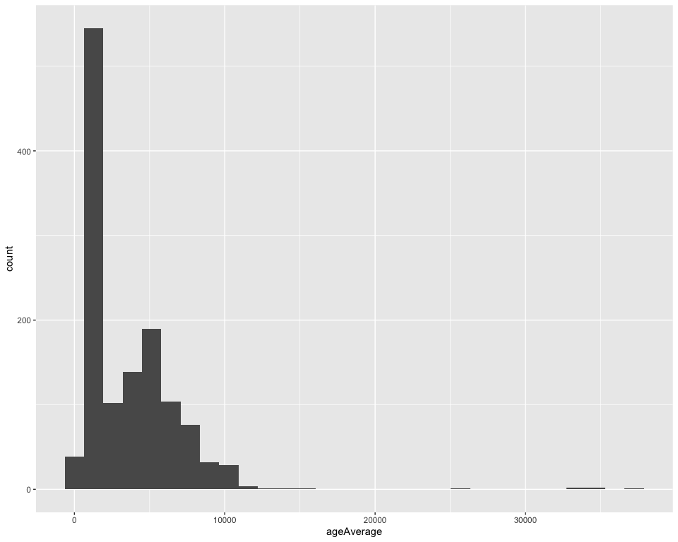<!-- -->

## Inspect Neanderthal tracts in ancient and present-day individuals

``` r
tracts_modern <- read_tracts("Modern", metadata)
#> Rows: 1272453 Columns: 26
#> ── Column specification ────────────────────────────────────────────────────────
#> Delimiter: "\t"
#> chr  (8): ID, population, superpop, region, clusterAlias, pop, groupAge, arc...
#> dbl (17): ageAverage, chrom, start, end, slod, sites, positive_lods, negativ...
#> lgl  (1): anc
#> 
#> ℹ Use `spec()` to retrieve the full column specification for this data.
#> ℹ Specify the column types or set `show_col_types = FALSE` to quiet this message.
tracts_ancient <- read_tracts("Ancient", metadata)
#> Rows: 1272453 Columns: 26
#> ── Column specification ────────────────────────────────────────────────────────
#> Delimiter: "\t"
#> chr  (8): ID, population, superpop, region, clusterAlias, pop, groupAge, arc...
#> dbl (17): ageAverage, chrom, start, end, slod, sites, positive_lods, negativ...
#> lgl  (1): anc
#> 
#> ℹ Use `spec()` to retrieve the full column specification for this data.
#> ℹ Specify the column types or set `show_col_types = FALSE` to quiet this message.

tracts <- rbind(tracts_modern, tracts_ancient)

tracts
#> # A tibble: 706,441 × 5
#>    ID      chrom     start       end set   
#>    <chr>   <chr>     <dbl>     <dbl> <chr> 
#>  1 HG00096 chr2  230587448 230666898 Modern
#>  2 HG00096 chr10  64618340  64832999 Modern
#>  3 HG00096 chr4   27175143  27250293 Modern
#>  4 HG00096 chr4   10555535  10667610 Modern
#>  5 HG00096 chr4   13699206  13788189 Modern
#>  6 HG00096 chr2  220777562 220862409 Modern
#>  7 HG00096 chr4    5744094   5795412 Modern
#>  8 HG00096 chr10  59975686  60034981 Modern
#>  9 HG00096 chr10  61792790  61851906 Modern
#> 10 HG00096 chr2  227251112 227379627 Modern
#> # ℹ 706,431 more rows
```

``` r
tracts %>%
filter(chrom %in% as.character(seqnames(deserts_gr))) %>%
ggplot(aes(x = start, xend = end, y = ID, yend = ID)) +
  geom_segment(linewidth = 1) +
  geom_rect(data = desert_coords, aes(xmin = start, xmax = end, ymin = -Inf, ymax = Inf), inherit.aes = FALSE, fill = "red", alpha = 0.1) +
  geom_vline(data = desert_coords, aes(xintercept = start), linetype = "dashed", color = "red") +
  geom_vline(data = desert_coords, aes(xintercept = end), linetype = "dashed", color = "red") +
  labs(x = "position along a chromosome [bp]", y = "each row = tracts in an individual") +
  theme_bw() +
  theme(
    axis.text.y = element_blank(),
    axis.ticks = element_blank(),
    panel.border = element_blank(),
    panel.grid = element_blank()
  ) +
  scale_x_continuous(labels = scales::comma) +
  facet_grid(set ~ chrom, scales = "free") +
  ggtitle("Neanderthal tracts in Eurasians")
```

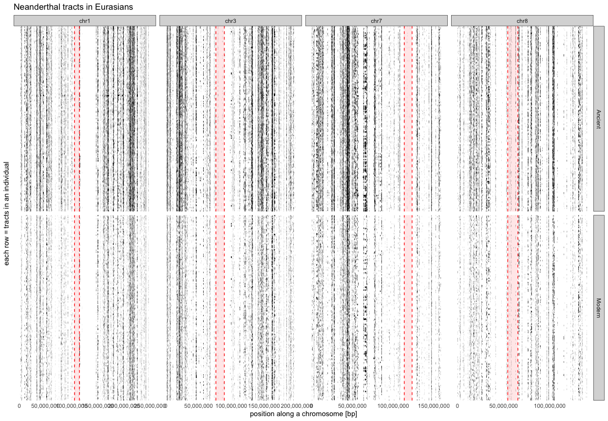<!-- -->

``` r
ggplot2::ggsave(paste0("results/tracts.pdf"), width = 13, height = 7)
```

## Testing code for window-based tract analysis on a toy example

### Generate testing tracts in a few individuals

``` r
tracts_gr <- GRanges(
  seqnames = "chr7",
  ranges = IRanges(c(2, 4, 12, 4, 12, 5), c(6, 6, 17, 7, 15, 7)),
  ID = c("ind1", "ind2", "ind1", "ind3", "ind3", "ind4")
)
seqlengths(tracts_gr) <- 20

tracts_gr
#> GRanges object with 6 ranges and 1 metadata column:
#>       seqnames    ranges strand |          ID
#>          <Rle> <IRanges>  <Rle> | <character>
#>   [1]     chr7       2-6      * |        ind1
#>   [2]     chr7       4-6      * |        ind2
#>   [3]     chr7     12-17      * |        ind1
#>   [4]     chr7       4-7      * |        ind3
#>   [5]     chr7     12-15      * |        ind3
#>   [6]     chr7       5-7      * |        ind4
#>   -------
#>   seqinfo: 1 sequence from an unspecified genome
```

``` r
ggplot(tracts_gr) +
  geom_rect(aes(group = ID, fill = ID)) +
  scale_x_continuous(breaks = seq_len(seqlengths(tracts_gr))) +
  coord_cartesian(xlim = c(1, seqlengths(tracts_gr))) +
  theme_minimal() +
  theme(panel.grid = element_blank())
```

<!-- -->

<!-- plot(NA, xlim = c(1, seqlengths(tracts_gr)), ylim = c(1, length(unique(tracts_gr$ID))), ylab = "individual") -->
<!-- segments(x0 = start(tracts_gr), x1 = end(tracts_gr), y0 = as.numeric(factor(tracts_gr$ID)), y1 = as.numeric(factor(tracts_gr$ID)), -->
<!--          col = factor(tracts_gr$ID)) -->

### Compute coverage of Neanderthal tracts per site (i.e. proportion of Neanderthal ancestry per site):

``` r
cov <- coverage(tracts_gr)
cov <- cov[[1]]
cov <- cov / length(unique(tracts_gr$ID))

plot(seq_along(cov), cov, type = "o",
     xlim = c(1, seqlengths(tracts_gr)), ylim = c(0, 1),
     ylab = "coverage per site")
```

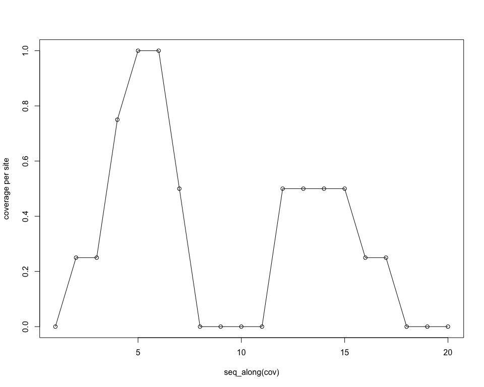<!-- -->

# prop_cov \<- cov / length(unique(tracts_gr\$ID))

# prop_cov

# plot(prop_cov\[\[1\]\], type = “o”, xlim = c(1, seqlengths(tracts_gr)))

# runcov \<- runmean(cov, 5)

# runcov

# plot(seq_along(runcov), runcov, type = “o”, xlim = c(0, seqlengths(tracts_gr)), ylab = “runmean() coverage”)

### Generate sliding windows

``` r
chrom_length <- seqlengths(tracts_gr)
window_size <- 5
step_size <- 3

windows <- slidingWindows(IRanges(start = 1, end = chrom_length), width = window_size, step = step_size)
windows_gr <- GRanges(seqnames = "chr7", ranges = unlist(windows))
windows_gr$id <- factor(seq_len(length(windows_gr)))
seqlengths(windows_gr) <- seqlengths(tracts_gr)
windows_gr
#> GRanges object with 6 ranges and 1 metadata column:
#>       seqnames    ranges strand |       id
#>          <Rle> <IRanges>  <Rle> | <factor>
#>   [1]     chr7       1-5      * |        1
#>   [2]     chr7       4-8      * |        2
#>   [3]     chr7      7-11      * |        3
#>   [4]     chr7     10-14      * |        4
#>   [5]     chr7     13-17      * |        5
#>   [6]     chr7     16-20      * |        6
#>   -------
#>   seqinfo: 1 sequence from an unspecified genome
```

Sanity check by plotting overlapping windows sequentially as tiles:

``` r
autoplot(windows_gr, aes(group = id), color = NA) + xlim(1, seqlengths(windows_gr))
```

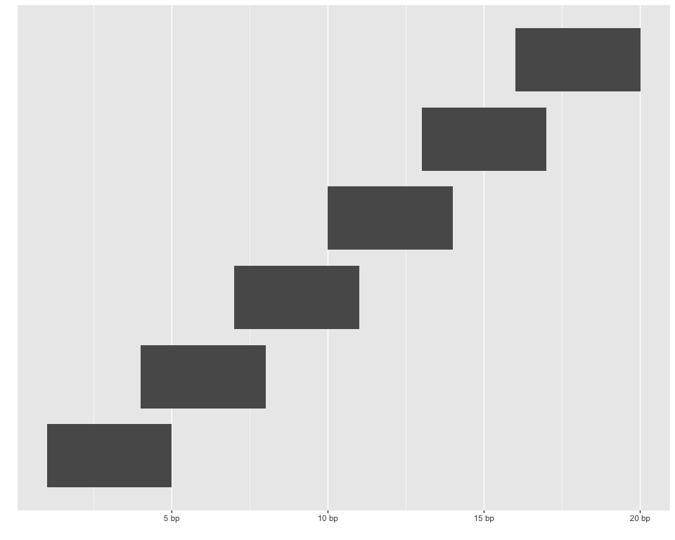<!-- -->

### Generate testing “mapping gaps”, “centromeres”, etc.

``` r
gaps_gr <- GRanges(seqnames = "chr7", ranges = IRanges(start = 8, end = 11))

to_remove <- queryHits(findOverlaps(windows_gr, gaps_gr))
windows_gr$gap <- FALSE
windows_gr[to_remove]$gap <- TRUE
```

``` r
plot(NA, xlim = c(1, seqlengths(windows_gr)), ylim = c(1, length(windows_gr)), ylab = "sliding window number")
segments(x0 = start(windows_gr), x1 = end(windows_gr), y0 = as.numeric(windows_gr$id), y1 = as.numeric(windows_gr$id),
         col = windows_gr$gap + 1)
```

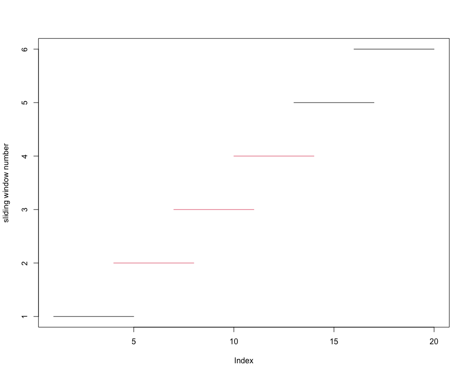<!-- -->

### Compute windows-based coverage (i.e. proportion of Neanderthal ancestry per window):

``` r
average_coverage_per_window <- function(windows_gr, cov) {
  sapply(seq_along(windows_gr), function(i) {
    start_idx <- start(windows_gr[i])
    end_idx <- end(windows_gr[i])
    mean(cov[start_idx:end_idx])
  })
}
mcols(windows_gr)$coverage <- average_coverage_per_window(windows_gr, as.numeric(cov))
mcols(windows_gr)$midpoint <- (start(windows_gr) + end(windows_gr)) / 2
```

``` r
plot(windows_gr$midpoint, windows_gr$coverage,
     ylab = "mean coverage in sliding window", type = "o", xlim = c(1, seqlengths(tracts_gr)), ylim = c(0, 1))
```

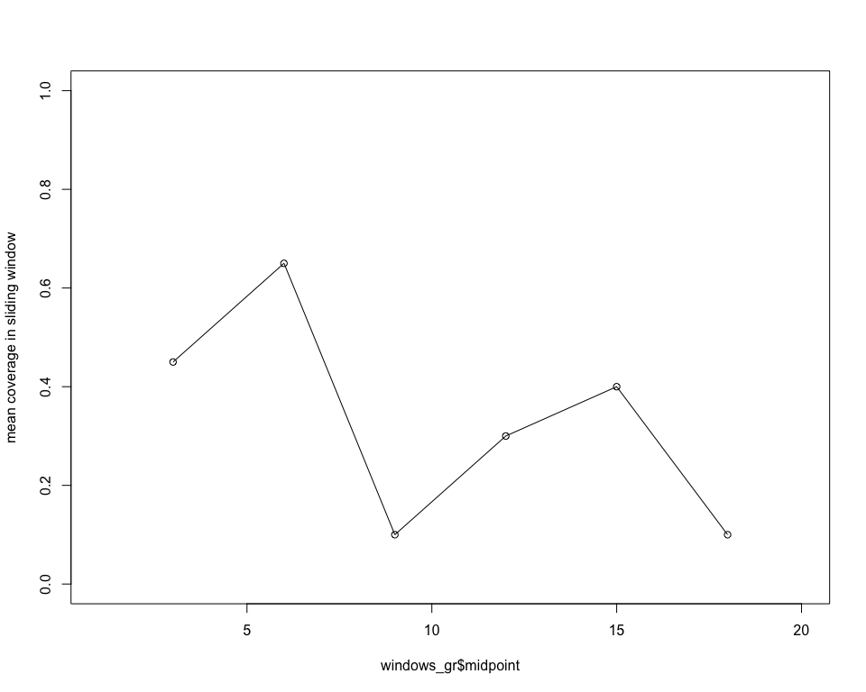<!-- -->

## Analysis of tracts inferred in real data

Convert the IBDmix tracts data frame to `GRanges`:

``` r
library(BSgenome.Hsapiens.UCSC.hg19)
#> Loading required package: BSgenome
#> Loading required package: Biostrings
#> Warning: package 'Biostrings' was built under R version 4.3.3
#> Loading required package: XVector
#> 
#> Attaching package: 'Biostrings'
#> The following object is masked from 'package:base':
#> 
#>     strsplit
#> Loading required package: BiocIO
#> Loading required package: rtracklayer
#> 
#> Attaching package: 'rtracklayer'
#> The following object is masked from 'package:BiocIO':
#> 
#>     FileForFormat

tracts_gr <- tracts %>% makeGRangesFromDataFrame(keep.extra.columns = TRUE)

seqlengths(tracts_gr) <- seqlengths(BSgenome.Hsapiens.UCSC.hg19)[names(seqlengths(tracts_gr))]
genome(tracts_gr) <- "hg19"

tracts_gr
#> GRanges object with 706441 ranges and 2 metadata columns:
#>            seqnames              ranges strand |          ID         set
#>               <Rle>           <IRanges>  <Rle> | <character> <character>
#>        [1]     chr2 230587448-230666898      * |     HG00096      Modern
#>        [2]    chr10   64618340-64832999      * |     HG00096      Modern
#>        [3]     chr4   27175143-27250293      * |     HG00096      Modern
#>        [4]     chr4   10555535-10667610      * |     HG00096      Modern
#>        [5]     chr4   13699206-13788189      * |     HG00096      Modern
#>        ...      ...                 ...    ... .         ...         ...
#>   [706437]    chr10 133049787-133108620      * |     YGS-B-2     Ancient
#>   [706438]     chr7 128914309-129062633      * |     YGS-B-2     Ancient
#>   [706439]    chr12   95113121-95323772      * |     YGS-B-2     Ancient
#>   [706440]     chr3   28709795-28766423      * |     YGS-B-2     Ancient
#>   [706441]    chr12   96050068-96129227      * |     YGS-B-2     Ancient
#>   -------
#>   seqinfo: 22 sequences from hg19 genome
```

### Fetch gaps from USCS

``` r
library(ggbio)
library(rtracklayer)
library(plyranges)

mySession <- browserSession()
genome(mySession) <- "hg19"
query <- ucscTableQuery(mySession, table = "gap")

# gap table columns: https://genome.ucsc.edu/cgi-bin/hgTables?db=hg38&hgta_group=map&hgta_track=gap&hgta_table=gap&hgta_doSchema=describe+table+schema
gaps <- getTable(query) %>%
  dplyr::filter(grepl("chr\\d+$", chrom)) %>% as_tibble() %>%
  filter(chrom %in% as.character(seqnames(deserts_gr)))

gaps_gr <- makeGRangesFromDataFrame(gaps, starts.in.df.are.0based = TRUE, keep.extra.columns = TRUE, ignore.strand = TRUE)
seqlengths(gaps_gr) <- seqlengths(tracts_gr)[as.character(seqnames(deserts_gr))]
genome(gaps_gr) <- genome(tracts_gr)

gaps_gr
#> GRanges object with 75 ranges and 6 metadata columns:
#>        seqnames              ranges strand |       bin        ix           n
#>           <Rle>           <IRanges>  <Rle> | <numeric> <numeric> <character>
#>    [1]     chr1 124535435-142535434      * |         0      1271           N
#>    [2]     chr1 121535435-124535434      * |        23      1270           N
#>    [3]     chr1     3845269-3995268      * |        76        47           N
#>    [4]     chr1   13219913-13319912      * |        85       154           N
#>    [5]     chr1   17125659-17175658      * |        89       196           N
#>    ...      ...                 ...    ... .       ...       ...         ...
#>   [71]     chr3             1-10000      * |       585         1           N
#>   [72]     chr3         10001-60000      * |       585         2           N
#>   [73]     chr3 194041962-194047251      * |      2065      1693           N
#>   [74]     chr3 197962431-198012430      * |      2095      1732           N
#>   [75]     chr3 198012431-198022430      * |      2095      1733           N
#>             size            type      bridge
#>        <numeric>     <character> <character>
#>    [1]   1.8e+07 heterochromatin          no
#>    [2]   3.0e+06      centromere          no
#>    [3]   1.5e+05          contig          no
#>    [4]   1.0e+05          contig          no
#>    [5]   5.0e+04           clone         yes
#>    ...       ...             ...         ...
#>   [71]     10000        telomere          no
#>   [72]     50000           clone          no
#>   [73]      5290          contig          no
#>   [74]     50000          contig          no
#>   [75]     10000        telomere          no
#>   -------
#>   seqinfo: 4 sequences from hg19 genome
```

``` r
gaps_gr %>%
  autoplot(aes(fill = type), color = NA) +
  theme_bw() +
  theme(panel.grid = element_blank(), legend.position = "bottom")
#> Warning: The `facets` argument of `facet_grid()` is deprecated as of ggplot2 2.2.0.
#> ℹ Please use the `rows` argument instead.
#> ℹ The deprecated feature was likely used in the ggbio package.
#>   Please report the issue at <https://github.com/lawremi/ggbio/issues>.
#> This warning is displayed once every 8 hours.
#> Call `lifecycle::last_lifecycle_warnings()` to see where this warning was
#> generated.
```

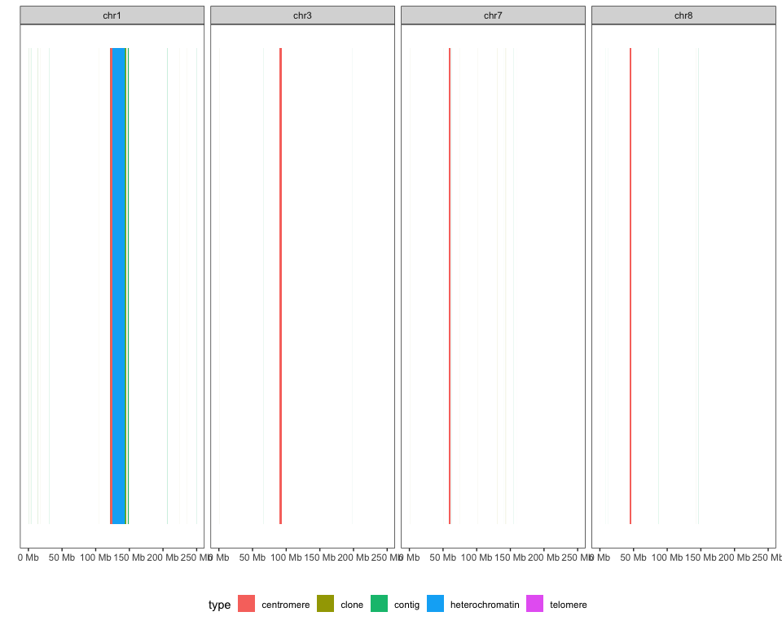<!-- -->

### Generate sliding windows along the chromosome

``` r
chrom <- "chr7"
```

``` r
chrom_length <- seqlengths(tracts_gr)[chrom]
window_size <- 200e3
step_size <- 50e3

windows <- slidingWindows(IRanges(start = 1, end = chrom_length), width = window_size, step = step_size)
windows_gr <- GRanges(seqnames = chrom, ranges = unlist(windows))
windows_gr$id <- factor(seq_len(length(windows_gr)))
seqlengths(windows_gr) <- seqlengths(tracts_gr)[chrom]
genome(windows_gr) <- genome(tracts_gr)
windows_gr
#> GRanges object with 3180 ranges and 1 metadata column:
#>          seqnames              ranges strand |       id
#>             <Rle>           <IRanges>  <Rle> | <factor>
#>      [1]     chr7            1-200000      * |        1
#>      [2]     chr7        50001-250000      * |        2
#>      [3]     chr7       100001-300000      * |        3
#>      [4]     chr7       150001-350000      * |        4
#>      [5]     chr7       200001-400000      * |        5
#>      ...      ...                 ...    ... .      ...
#>   [3176]     chr7 158750001-158950000      * |     3176
#>   [3177]     chr7 158800001-159000000      * |     3177
#>   [3178]     chr7 158850001-159050000      * |     3178
#>   [3179]     chr7 158900001-159100000      * |     3179
#>   [3180]     chr7 158950001-159138663      * |     3180
#>   -------
#>   seqinfo: 1 sequence from hg19 genome
```

Mark windows hitting gaps to be removed:

``` r
to_remove <- queryHits(findOverlaps(windows_gr, gaps_gr))
windows_gr$gap <- FALSE
windows_gr[to_remove]$gap <- TRUE
```

As sanity check, plot all windows along the chromosome:

``` r
plot(NA, xlim = c(1, seqlengths(windows_gr)), ylim = c(1, length(windows_gr)), ylab = "sliding window number")
segments(x0 = start(windows_gr), x1 = end(windows_gr), y0 = as.numeric(windows_gr$id), y1 = as.numeric(windows_gr$id),
         col = windows_gr$gap + 1)
```

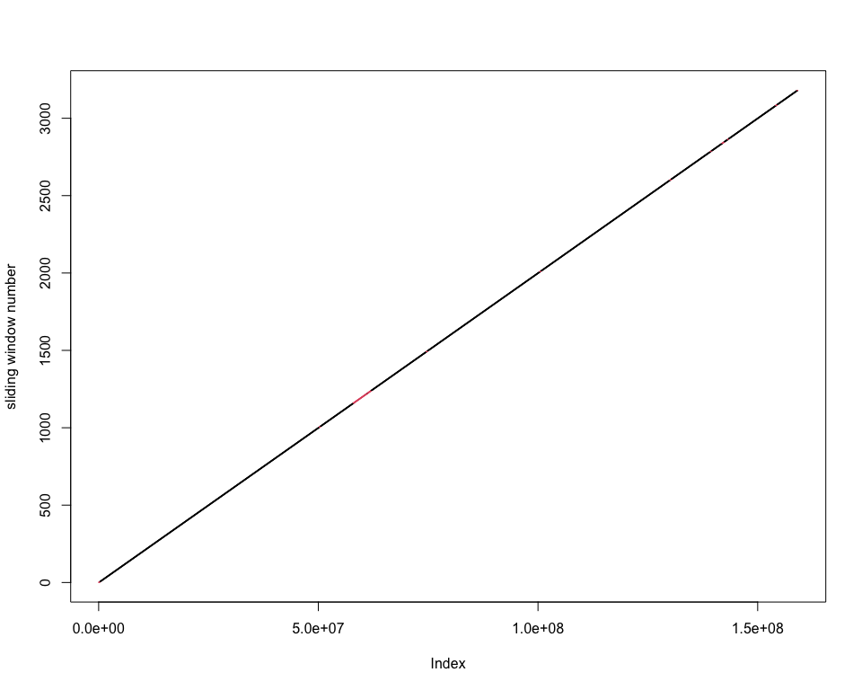<!-- -->

Plot only the first and last 2 Mb of windows on both ends of the
chromosome:

``` r
plotting_cutoff <- 2e6

plot(NA, xlim = c(1, plotting_cutoff), ylim = c(1, length(windows_gr[start(windows_gr) < plotting_cutoff])), ylab = "sliding window number")
segments(x0 = start(windows_gr), x1 = end(windows_gr), y0 = as.numeric(windows_gr$id), y1 = as.numeric(windows_gr$id),
         col = windows_gr$gap + 1)
```

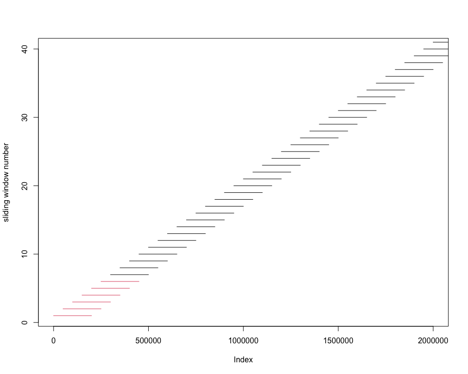<!-- -->

``` r

plot(NA, xlim = c(seqlengths(windows_gr) - plotting_cutoff, seqlengths(windows_gr)), ylim = c(length(windows_gr) - length(windows_gr[start(windows_gr) < plotting_cutoff]), length(windows_gr)), ylab = "sliding window number")
segments(x0 = start(windows_gr), x1 = end(windows_gr), y0 = as.numeric(windows_gr$id), y1 = as.numeric(windows_gr$id),
         col = windows_gr$gap + 1)
```

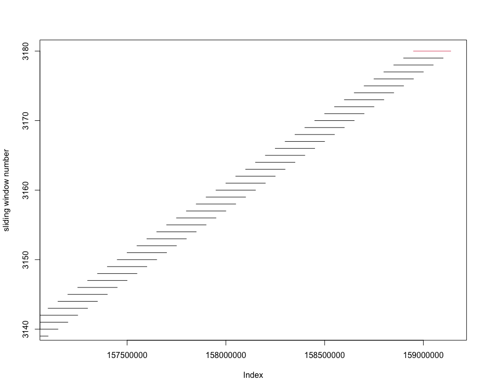<!-- -->

### Analyse tracts in windows

``` r
windows_gr <- generate_windows(tracts_gr, gaps_gr, chrom = "chr7", window_size = 200e3, step_size = 50e3)

ancestry_modern_gr <- compute_ancestry(windows_gr, tracts_gr, "Modern")
ancestry_ancient_gr <- compute_ancestry(windows_gr, tracts_gr, "Ancient")
```

``` r
desert <- subset(desert_coords, chrom == unique(chrom[1]))

ancestry_gr <- rbind(
  dplyr::as_tibble(ancestry_modern_gr) %>% select(chrom = seqnames, start, end, midpoint, coverage, set, gap),
  dplyr::as_tibble(ancestry_ancient_gr) %>% select(chrom = seqnames, start, end, midpoint, coverage, set, gap)
) %>%
  pivot_wider(names_from = "set", values_from = "coverage") %>%
  mutate(within_desert = start >= desert$start & end <= desert$end)

p1 <- ancestry_gr %>%
  filter(start >= (desert$start * 0.9) & end <= (desert$end * 1.1)) %>%
  {
    ggplot(data = .) +
    geom_line(aes(midpoint, ancient), color = "orange") +
    geom_point(data = filter(., ancient > 0), aes(midpoint, ancient, color = "ancient individuals"), size = 0.8) +
    geom_line(aes(midpoint, modern), color = "blue") +
    geom_point(data = filter(., modern > 0), aes(midpoint, modern, color = "present-day individuals"), size = 0.8) +
    geom_vline(data = desert, aes(xintercept = start, linetype = "desert boundary"), color = "red") +
    geom_vline(data = desert, aes(xintercept = end, linetype = "desert boundary"), color = "red") +
    scale_color_manual(values = c("orange", "blue")) +
    guides(color = guide_legend("", override.aes = list(size = 5)),
           linetype = guide_legend("")) +
    labs(x = "genomic coordinate [bp]", y = "proportion of Neanderthal ancestry") +
    scale_x_continuous(labels = scales::comma) +
    scale_linetype_manual(values = "dashed") +
    theme_minimal() +
    theme(legend.position = "bottom") +
    ggtitle(paste("Archaic ancestry desert on chromosome", gsub("chr", "", .$chrom[1])))
  }
```

``` r
mean(ancestry_gr$modern)
#> [1] 0.01398875
mean(ancestry_gr$ancient)
#> [1] 0.01428588
```

``` r
ancestry_gr %>% filter(within_desert) %>% { cor(.$ancient, .$modern) }
#> [1] 0.9730307
```

# desert_win \<- win %\>% filter(desert)

# res \<- lm(modern ~ ancient, data = desert_win)

# plot(desert_win$ancient, desert_win$modern, xlim = c(0, 0.01), ylim = c(0, 0.01))

# abline(a = 0, b = 1)

# abline(res, col = “red”)

``` r
data_range <- c(ancestry_gr$ancient, ancestry_gr$modern) %>% .[. > 0] %>% range

p2 <- ggplot() +
  geom_smooth(data = filter(ancestry_gr, within_desert, ancient > 0, modern > 0), aes(ancient, modern, color = within_desert),
              color = "red", fill = "black", method = "lm", linetype = "dashed", linewidth = 0.8, alpha = 0.35) +
  geom_point(data = filter(ancestry_gr, !within_desert, ancient > 0, modern > 0), aes(ancient, modern, color = desert, shape = "outside desert"),
             color = "lightgray", alpha = 0.5) +
  geom_point(data = filter(ancestry_gr, within_desert, ancient > 0, modern > 0), aes(ancient, modern, color = within_desert, shape = "within desert"), color = "black") +
  geom_abline(slope = 1, linetype = "dashed") +
  geom_hline(aes(color = "modern", yintercept = mean(ancestry_gr$modern)), linetype = "dashed", color = "blue") +
  geom_vline(aes(color = "ancient", xintercept = mean(ancestry_gr$ancient)), linetype = "dashed", color = "orange") +
  scale_x_log10(labels = scales::percent_format(accuracy = 0.01)) +
  scale_y_log10(labels = scales::percent_format(accuracy = 0.01)) +
  labs(x = "Neanderthal ancestry proportion\nin ancient Eurasians [%, log scale]",
       y = "Neanderthal ancestry proportion \ninpresent-day Eurasians [%, log scale]") +
  coord_fixed(xlim = data_range, ylim = data_range) +
  theme_minimal() +
  theme(legend.position = "bottom") +
  guides(shape = guide_legend("window", override.aes = list(alpha = 1, size = 3)),
         linetype = "none") +
  scale_shape_manual(values = c(4, 20))
```

``` r
cowplot::plot_grid(p1, p2, nrow = 1, rel_widths = c(1, 0.7))
#> `geom_smooth()` using formula = 'y ~ x'
```

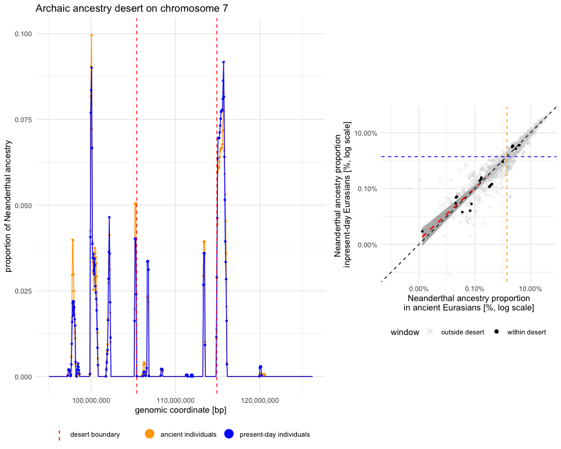<!-- -->

``` r
ggsave(filename = "results/desert_comparison.pdf", width = 13, height = 7, units = "in")
```

``` r
ancestry_gr %>%
  filter(within_desert) %>%
  summarise(
    mean(ancient == 0 & modern > 0),
    mean(ancient > 0 & modern == 0),
    mean((ancient == 0 & modern == 0) | (ancient > 0 & modern > 0))
  ) %>%
  pivot_longer(cols = everything())
#> # A tibble: 3 × 2
#>   name                                                             value
#>   <chr>                                                            <dbl>
#> 1 mean(ancient == 0 & modern > 0)                                 0.0321
#> 2 mean(ancient > 0 & modern == 0)                                 0.0214
#> 3 mean((ancient == 0 & modern == 0) | (ancient > 0 & modern > 0)) 0.947

ancestry_gr %>% filter(within_desert) %>% filter(modern == 0) %>% { .$ancient * 100 } %>% summary
#>      Min.   1st Qu.    Median      Mean   3rd Qu.      Max. 
#> 0.0000000 0.0000000 0.0000000 0.0006131 0.0000000 0.0290528
```
