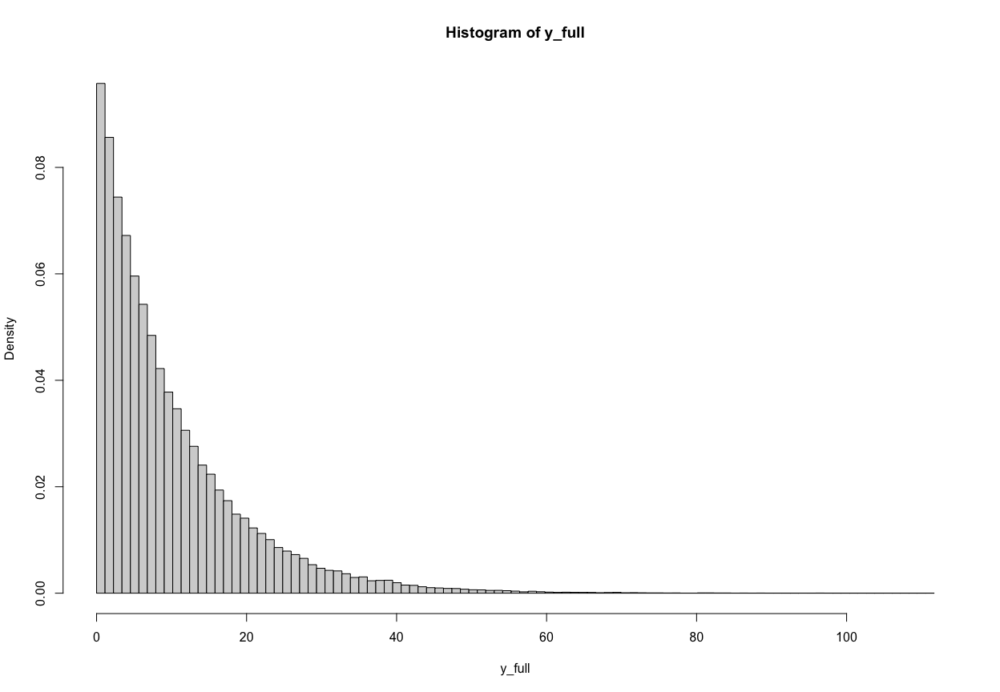
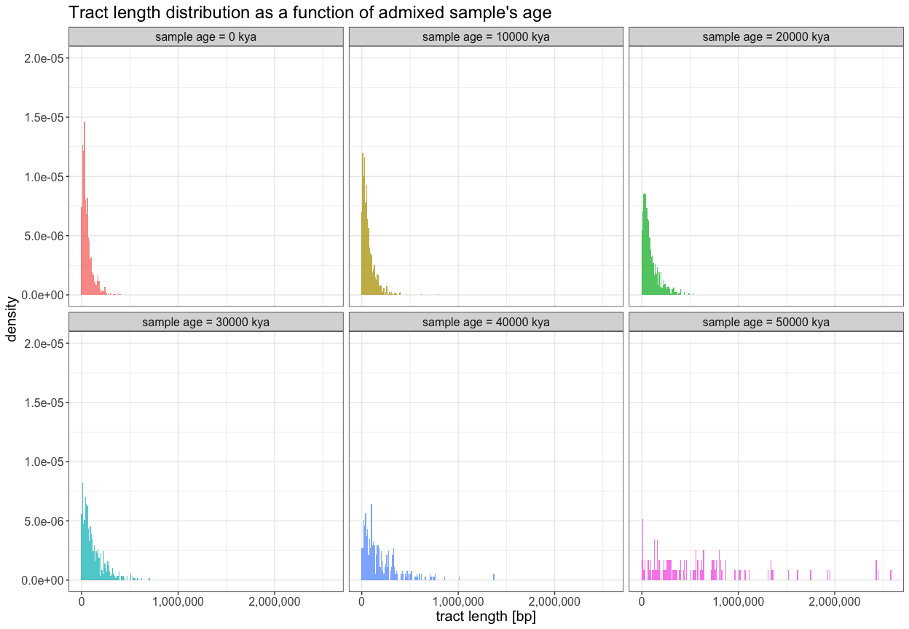
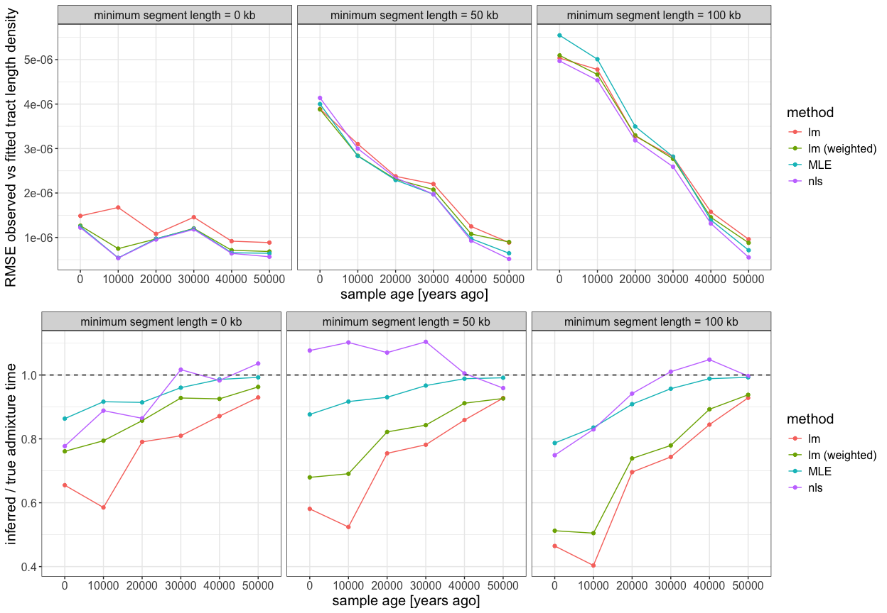
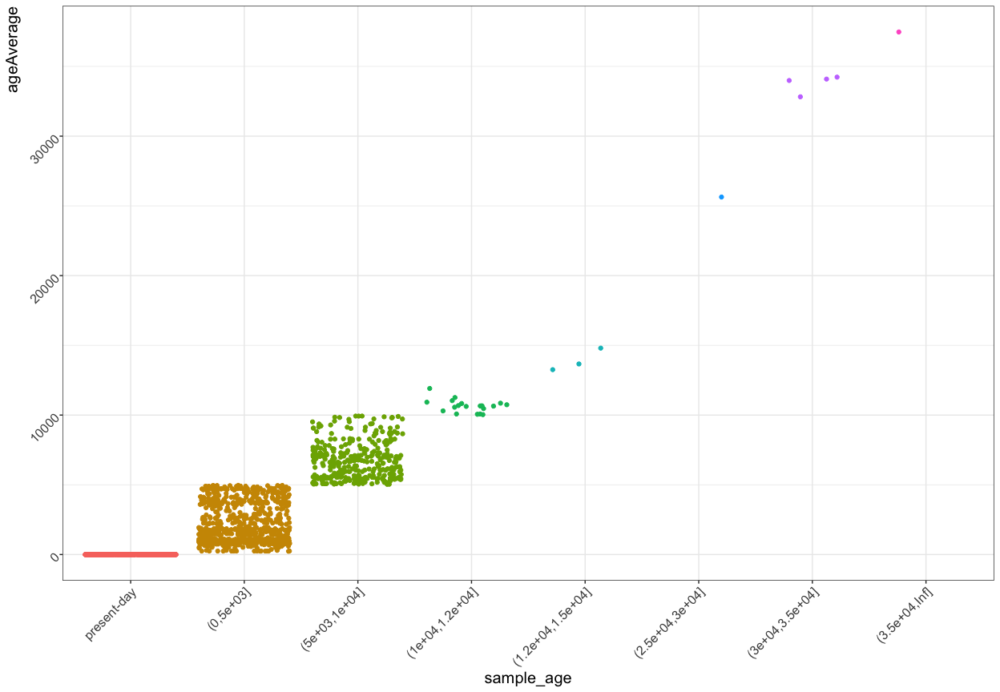
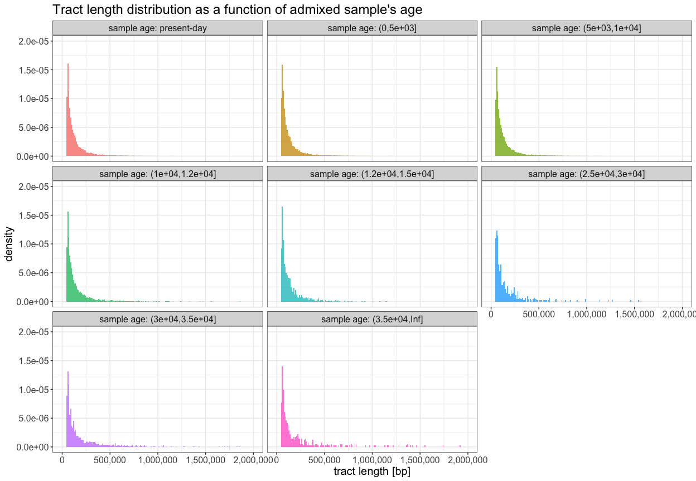
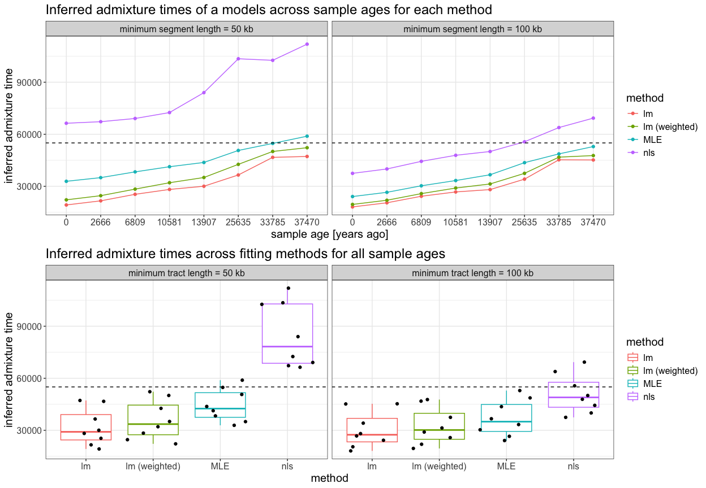
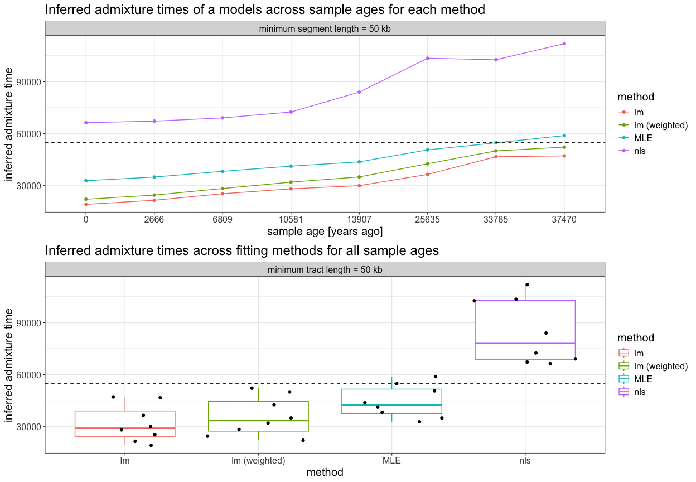
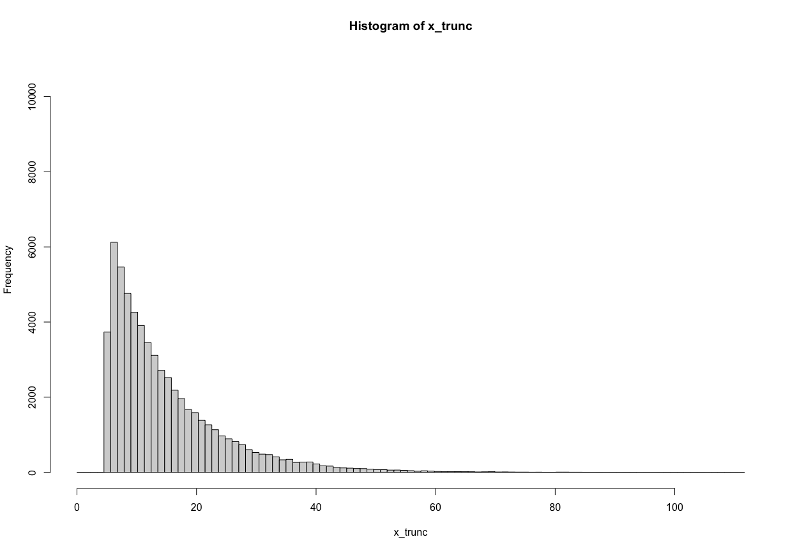

``` r
library(ggplot2)
library(readr)
library(dplyr)
#> 
#> Attaching package: 'dplyr'
#> The following objects are masked from 'package:stats':
#> 
#>     filter, lag
#> The following objects are masked from 'package:base':
#> 
#>     intersect, setdiff, setequal, union
library(tidyr)
library(Metrics)

library(slendr)
init_env(quiet = TRUE)

suppressPackageStartupMessages(source(here::here("utils.R")))
#> Warning: package 'GenomeInfoDb' was built under R version 4.3.3
```

## Testing the admixture dating methodology on simulations

``` r
anc <- population("ancestor", N = 10000, time = 1000000, remove = 649000)
afr <- population("AFR", parent = anc, N = 10000, time = 650000)
nea <- population("NEA", parent = anc, N = 2000, time = 650000)
eur <- population("EUR", parent = afr, N = 5000, time = 80000)

# https://www.science.org/doi/full/10.1126/sciadv.abm7047
gen_time <- 27
t_admix <- round(55000 / gen_time) * gen_time

gf <- gene_flow(from = nea, to = eur, rate = 0.03, start = t_admix, end = t_admix - gen_time)

model <- compile_model(
  populations = list(anc, afr, nea, eur), gene_flow = gf,
  generation_time = gen_time
)

samples <- schedule_sampling(model, times = c(50, 40, 30, 20, 10, 0) * 1e3, list(eur, 10))

plot_model(model, proportions = TRUE, order = c("AFR", "EUR", "ancestor", "NEA"))
```

<!-- -->

``` r
ts <- msprime(model, sequence_length = 100e6, recombination_rate = 1e-8, samples = samples, random_seed = 42)

tracts_df <- ts_tracts(ts, census = t_admix, quiet = TRUE) %>%
  dplyr::select(-node_id, -pop, -source_pop, -source_pop_id)

samples_df <- ts_samples(ts) %>% dplyr::rename(sample_age = time)

tracts_df <- inner_join(samples_df, tracts_df, by = "name")

write.table(tracts_df, file = "data/sim_tracts.tsv",
            sep = "\t", row.names = FALSE, col.names = TRUE, quote = FALSE)
```

``` r
tracts_df <- read_tsv("data/sim_tracts.tsv")
#> Rows: 4280 Columns: 6
#> ── Column specification ────────────────────────────────────────────────────────
#> Delimiter: "\t"
#> chr (2): name, pop
#> dbl (4): sample_age, left, right, length
#> 
#> ℹ Use `spec()` to retrieve the full column specification for this data.
#> ℹ Specify the column types or set `show_col_types = FALSE` to quiet this message.
```

## Comparison of filtered and unfiltered tract distributions

``` r
ggplot() +
  geom_histogram(
    data = tracts_df, aes(x = length, y = after_stat(density), fill = as.factor(sample_age)),
    binwidth = 10000, alpha = 0.75
  ) +
  geom_density(data = tracts_df, aes(length), alpha = 0.2) +
  labs(
    x = "tract length [bp]", y = "density", fill = "age of sample",
    title = "Tract length distribution as a function of admixed sample's age"
  ) +
  scale_x_continuous(labels = scales::comma) +
  expand_limits(y = 0) +
  coord_cartesian(ylim = c(0, 2e-5)) +
  theme_bw() +
  theme(legend.position = "none", text = element_text(size = 15)) +
  facet_wrap(~ sample_age, labeller = labeller(sample_age = function(x) paste("sample age =", x, "kya")))
```

<!-- -->

<!-- ```{r} -->
<!-- min_length <- 50e3 -->
<!-- ggplot() + -->
<!--   geom_density(data = tracts_df, -->
<!--                aes(length, y = after_stat(count), color = factor(sample_age), linetype = "unfiltered")) + -->
<!--   geom_density(data = filter(tracts_df, length >= min_length), -->
<!--                aes(length, y = after_stat(count), color = factor(sample_age), linetype = "filtered"), -->
<!--                color = "black") + -->
<!--   guides(color = "none") + -->
<!--   labs(linetype = "tracts") + -->
<!--   scale_linetype_manual(values = c("unfiltered" = "solid", "filtered" = "dashed")) + -->
<!--   facet_wrap(~ sample_age, labeller = labeller(sample_age = function(x) paste("sample age =", x, "kya"))) + -->
<!--   coord_cartesian(xlim = c(0, 1e6)) + -->
<!--   theme_bw() -->
<!-- ``` -->

## Estimating admixture time from tract lengths

``` r
# sample_age <- 0
# min_length <- 0

max_length <- Inf

results <- list()

pdf("dating_sims.pdf", width = 14, height = 8)

for (min_length in c(0, 50e3, 100e3)) {

  plot(1, type = "n", axes = FALSE, xlab = "", ylab = "", xlim = c(0, 1), ylim = c(0, 1))
  text(0.5, 0.5, paste("Minimum tract length:", as.integer(min_length), "bp"), cex = 3)
  
  for (sample_age in sort(unique(tracts_df$sample_age))) {
    
    # cat("minimum length:", min_length, "\nsample_age:", sample_age, "\n")
    
    r <- 1e-8
    
    filtered_tracts <- tracts_df %>% filter(sample_age == !!sample_age, length >= min_length, length <= max_length)
    
    bin_data <- hist(filtered_tracts$length, plot = FALSE, breaks = 100)
    density <- bin_data$density
    length <- bin_data$mids[density > 0]
    density <- density[density > 0]
    
    # lm estimate of admixture time
    #   -- based on log-transformed linear fit of density vs tract length
    lm_res <- lm(log(density) ~ length)
    lambda_lm <- -coef(lm_res)[["length"]]
    if (lambda_lm < 0) lambda_lm <- NA
    
    t_gens_lm <- lambda_lm / r
    t_lm <- t_gens_lm * gen_time + sample_age
    
    # weighted lm estimate of admixture time
    #   -- based on log-transformed linear fit of density vs tract length
    lmw_res <- lm(log(density) ~ length, weights = 1 / length)
    lambda_lmw <- -coef(lmw_res)[["length"]]
    if (lambda_lmw < 0) lambda_lmw <- NA
    
    t_gens_lmw <- lambda_lmw / r
    t_lmw <- t_gens_lmw * gen_time + sample_age
    
    # MLE estimate of admixture time
    #  -- based on computing average length as the expectation of the theoretical exponential distribution
    L <- mean(filtered_tracts$length)
    lambda_mean <- 1 / (L - min_length)
    
    t_gens_mean <- lambda_mean / r
    t_mean <- t_gens_mean * gen_time + sample_age
    
    # nls estimate -- computing the rate of decay (lambda) by fitting an exponential curve directly
    # https://www.rdocumentation.org/packages/stats/versions/3.6.2/topics/SSasymp 
    nls_res <- tryCatch(
      nls(density ~ SSasymp(length, Asym, R0, lrc)),
      error = function(e) NA, warning = function(w) NA
    )
    failed_nls <- !inherits(nls_res, "nls")
    lambda_nls <- if (failed_nls) NA else exp(unname(coef(nls_res)["lrc"]))
    t_gens_nls <- lambda_nls / r
    t_nls <- t_gens_nls * gen_time + sample_age
    
    # plotting
    orig_par <- par(no.readonly = TRUE)
    
    par(mfrow = c(1, 2))
    
    title <- sprintf("sample age %d, tract length [%d kb, %.1f Mb]",
                     sample_age, round(min_length / 1e3, 1), round(max_length / 1e6, 1))
    
    legends <- c(
      sprintf("lm fit: admixture %.1f generations prior ~ %.1f kya", t_gens_lm, round(t_lm / 1e3, 1)),
      sprintf("weighted lm fit: admixture %.1f generations prior ~ %.1f kya", t_gens_lmw, round(t_lmw / 1e3, 1)),
      sprintf("MLE fit: admixture %.1f generations prior ~ %.1f kya", t_gens_mean, round(t_mean / 1e3, 1)),
      sprintf("nls fit: admixture %.1f generations prior ~ %.1f kya", t_gens_nls, round(t_nls / 1e3, 1))
    )
    
    # plot the results on the original exponential scale (although we fit truncated exponential,
    # the rate corresponds to the shape of the original unfiltered exponential function, so we
    # compute dexp() on the original unfiltered x-axis scale for plotting purposes)
    x_values <- sort(unique(c(length, seq(0, max(tracts_df$length), by = 5000))))
    y_lm <- dexp(x_values, rate = lambda_lm)
    y_lmw <- dexp(x_values, rate = lambda_lmw)
    y_mean <- dexp(x_values, rate = lambda_mean)
    y_nls <- if (failed_nls) NA else predict(nls_res, newdata = data.frame(length = x_values + min_length))
    
    ylim <- c(min(c(density, y_lm, y_lmw, y_mean, y_nls), na.rm = TRUE),
              3e-5) #max(c(density, y_lm, y_mean, y_nls), na.rm = TRUE))
    plot(length, density, xlim = c(0, 1e6), main = title, ylim = ylim)
    abline(v = min_length, lty = "dashed")
    lines(x_values + min_length, y_lm, col = "purple", lty = 2, lwd = 2)
    lines(x_values + min_length, y_lmw, col = "darksalmon", lty = 2, lwd = 2)
    lines(x_values + min_length, y_mean, col = "blue", lty = 2, lwd = 2)
    if (!failed_nls)
      lines(x_values + min_length, y_nls, col = "green", lty = 2, lwd = 2)
    
    legend("topright", fill = c("purple", "darksalmon", "blue", "green"), legend = legends)
    
    # plot the results on the log-transformed scale
    plot(length, log(density), xlim = c(0, 1e6), main = title, ylim = c(-15, -11))
    abline(v = min_length, lty = "dashed")
    abline(lm_res, col = "purple", lty = 2, lwd = 2)
    abline(lmw_res, col = "darksalmon", lty = 2, lwd = 2)
    abline(a = log(lambda_mean) + lambda_mean * min_length, b = -lambda_mean, col = "blue", lty = 2, lwd = 2)
    if (!failed_nls)
      suppressWarnings(lines(x_values, log(y_nls), col = "green", lty = 2, lwd = 2))
    
    legend("topright", fill = c("purple", "darksalmon", "blue", "green"), legend = legends)
    
    par(orig_par)
    
    fitted_idx <- match(length, x_values)
    rmse_lm <- rmse(density, y_lm[fitted_idx])
    rmse_lmw <- rmse(density, y_lmw[fitted_idx])
    rmse_mean <- rmse(density, y_mean[fitted_idx])
    rmse_nls <- rmse(density, y_nls[fitted_idx])
    
    results[[length(results) + 1]] <- tibble(
      sample_age = sample_age,
      min_length = min_length,
      method = c("lm", "lm (weighted)", "MLE", "nls"),
      lambda = c(lambda_lm, lambda_lmw, lambda_mean, lambda_nls),
      rmse_density = c(rmse_lm, rmse_lmw, rmse_mean, rmse_nls),
      t_inferred = c(t_lm, t_lmw, t_mean, t_nls),
      ratio_time = t_inferred / t_admix
    )
  
  }
}

dev.off()
#> quartz_off_screen 
#>                 2

results_df <- do.call(rbind, results)
```

``` r
p_density <- results_df %>%
  ggplot(aes(as.factor(sample_age), rmse_density, color = method)) +
    geom_point() +
    geom_line(aes(group = method)) +
    theme_bw() +
    theme(text = element_text(size = 15)) +
    xlab("sample age [years ago]") +
    ylab("RMSE observed vs fitted tract length density") +
    facet_wrap(~ min_length,
               labeller = labeller(min_length = function(x) paste("minimum segment length =", as.integer(x) / 1e3, "kb")))
  
p_time <- results_df %>%
  ggplot(aes(as.factor(sample_age), ratio_time, color = method)) +
    geom_point() +
    geom_line(aes(group = method)) +
    geom_hline(yintercept = 1, linetype = "dashed") +
    theme_bw() +
    theme(text = element_text(size = 15)) +
    xlab("sample age [years ago]") +
    ylab("inferred / true admixture time") +
    facet_wrap(~ min_length,
               labeller = labeller(min_length = function(x) paste("minimum segment length =", as.integer(x) / 1e3, "kb")))

cowplot::plot_grid(p_density, p_time, nrow = 2)
```

<!-- -->

``` r
p_density2 <- results_df %>%
  ggplot(aes(method, rmse_density)) +
  geom_boxplot(aes(color = method)) +
  geom_jitter() +
  expand_limits(y = 0) +
  theme_bw() +
  theme(text = element_text(size = 15)) +
  facet_wrap(
    ~ min_length,
    labeller = labeller(min_length = function(x) paste("minimum tract length =", as.integer(x) / 1e3, "kb"))
  )

p_time2 <- results_df %>%
  ggplot(aes(method, ratio_time)) +
  geom_boxplot(aes(color = method)) +
  geom_jitter() +
  geom_hline(yintercept = 1, linetype = "dashed") +
  theme_bw() +
  theme(text = element_text(size = 15)) +
  facet_wrap(
    ~ min_length,
    labeller = labeller(min_length = function(x) paste("minimum tract length =", as.integer(x) / 1e3, "kb"))
  )

cowplot::plot_grid(p_density2, p_time2, nrow = 2)
```

<!-- -->

## Estimating admixture time from tract lengths v2

``` r
# min_length <- 0

pdf("dating_sims_v2.pdf", width = 12, height = 10)

results_v2 <- list()

max_length <- Inf

for (min_length in c(0, 50e3, 100e3)) {
  tracts_filt_df <- tracts_df %>% filter(length >= min_length, length <= max_length)

  p_tracts <-
    ggplot() +
    geom_histogram(
      data = tracts_filt_df, aes(x = length, y = after_stat(density), fill = as.factor(sample_age)),
      binwidth = 10000, alpha = 0.75) +
    # geom_density(
    #   data = tracts_filt_df, aes(x = length, y = after_stat(density), fill = as.factor(sample_age)),
    #   bw = 5000, alpha = 0.75, color = FALSE) +
    labs(
      x = "tract length [bp]", y = "density", fill = "age of sample",
      title = "Tract length distribution as a function of admixed sample's age",
      subtitle = paste0(
        "(assuming single-pulse admixture at ~ 55 kya, tract length [",
        as.integer(min_length / 1e3), " kb, ", max_length / 1e6," Mb])"
      )
    ) +
    scale_x_continuous(labels = scales::comma) +
    expand_limits(y = 0) +
    coord_cartesian(ylim = c(0, 2e-5)) +
    theme_minimal() +
    theme(legend.position = "none", text = element_text(size = 15)) +
    facet_wrap(~ sample_age, labeller = labeller(sample_age = function(x) paste("sample age =", x, "kya")))
  
  r <- 1e-8
  
  exp_df <- group_by(tracts_filt_df, sample_age) %>%
    summarise(L = mean(length)) %>%
    mutate(
      lambda = 1 / (L - min_length),
      t_gen = lambda / r,
      t_before = t_gen * gen_time,
      t_inferred = t_before + sample_age
    )
  
  exp_decay <- function(lambda, max) {
    data.frame(length = seq(0, max, by = 1000)) %>%
      mutate(density = dexp(length, rate = lambda))
  }
  
  predictions_df <-
    exp_df %>%
    select(sample_age, lambda) %>%
    rowwise() %>%
    mutate(exp_data = list(exp_decay(lambda, max(tracts_filt_df$length)))) %>%
    unnest(cols = c(exp_data)) %>%
    select(-lambda)
  
  p_fit <- p_tracts +
    geom_line(data = predictions_df, aes(x = length + min_length, y = density),
              linetype = "dashed", linewidth = 0.75, color = "black") +
    geom_text(data = exp_df,
              aes(x = Inf, y = Inf, label = paste("estimated admixture at", round(t_inferred / 1e3, 1), "kya"),
                  color = as.factor(sample_age)),
              hjust = 1.2, vjust = 8, size = 4)
  
  print(p_fit)
  
  results_v2[[length(results_v2) + 1]] <- exp_df %>% mutate(min_length = min_length)
}

dev.off()
#> quartz_off_screen 
#>                 2

results_v2_df <- do.call(rbind, results_v2)
```

``` r
inner_join(
  filter(results_df, method == "MLE") %>% select(sample_age, min_length, t_inferred),
  select(results_v2_df, sample_age, min_length, t_inferred),
  by = c("sample_age", "min_length")
) %>%
  mutate(equal = t_inferred.x == t_inferred.y) %>%
  .$equal %>%
  all()
#> [1] TRUE
```

## Admixture dating in empirical data

``` r
metadata <- read_metadata()
#> Rows: 4172 Columns: 32
#> ── Column specification ────────────────────────────────────────────────────────
#> Delimiter: "\t"
#> chr (22): sampleId, popId, site, country, region, groupLabel, groupAge, flag...
#> dbl (10): shapeA, latitude, longitude, age14C, ageHigh, ageLow, ageAverage, ...
#> 
#> ℹ Use `spec()` to retrieve the full column specification for this data.
#> ℹ Specify the column types or set `show_col_types = FALSE` to quiet this message.

metadata$sample_age <- cut(metadata$ageAverage,
                           breaks = c(Inf, 35e3, 30e3, 25e3, 20e3, 15e3, 12e3, 10e3, 5e3,  0))

group_levels <- levels(metadata$sample_age)

metadata <- metadata %>%
  mutate(
    sample_age = as.character(sample_age),
    sample_age = ifelse(is.na(sample_age), "present-day", sample_age),
    sample_age = factor(sample_age, levels = c("present-day", group_levels))
  )

ggplot(metadata) +
  geom_jitter(aes(sample_age, ageAverage, color = sample_age)) +
  theme_bw() +
  theme(legend.position = "none", text = element_text(size = 15, angle = 45, hjust = 1),
        axis.title.x = element_text(size = 15, angle = 0, hjust = 0.5))
```

<!-- -->

``` r
metadata %>%
  group_by(sample_age) %>%
  summarise(mean(ageAverage))
#> # A tibble: 8 × 2
#>   sample_age        `mean(ageAverage)`
#>   <fct>                          <dbl>
#> 1 present-day                       0 
#> 2 (0,5e+03]                      1970.
#> 3 (5e+03,1e+04]                  6738.
#> 4 (1e+04,1.2e+04]               10652.
#> 5 (1.2e+04,1.5e+04]             13907.
#> 6 (2.5e+04,3e+04]               25635 
#> 7 (3e+04,3.5e+04]               33785.
#> 8 (3.5e+04,Inf]                 37470
```

``` r
library(sf)
#> Linking to GEOS 3.11.0, GDAL 3.5.3, PROJ 9.1.0; sf_use_s2() is TRUE
library(rnaturalearth)

world <- ne_countries(scale = "medium", returnclass = "sf")
sf::st_agr(world) <- "constant"
bbox <- st_as_sfc(st_bbox(c(xmin = -25, xmax = 65, ymin = 25, ymax = 70), crs = st_crs(world)))
western_eurasia <- st_crop(st_make_valid(world), bbox)

metadata %>%
  filter(!is.na(latitude) & !is.na(longitude)) %>%
  st_as_sf(coords = c("longitude", "latitude")) %>%
  st_set_crs(4326) %>%
  ggplot() +
    geom_sf(data = western_eurasia) +
    geom_sf(aes(color = sample_age)) +
    coord_sf(crs = 3035) +
    facet_wrap(~ sample_age) +
    theme_bw() +
    theme(legend.position = "none", text = element_text(size = 15))
```

<!-- -->

``` r
tracts_df <- rbind(read_tracts("Modern", metadata), read_tracts("Ancient", metadata))
#> Rows: 1272453 Columns: 26
#> ── Column specification ────────────────────────────────────────────────────────
#> Delimiter: "\t"
#> chr  (8): ID, population, superpop, region, clusterAlias, pop, groupAge, arc...
#> dbl (17): ageAverage, chrom, start, end, slod, sites, positive_lods, negativ...
#> lgl  (1): anc
#> 
#> ℹ Use `spec()` to retrieve the full column specification for this data.
#> ℹ Specify the column types or set `show_col_types = FALSE` to quiet this message.
#> Rows: 1272453 Columns: 26
#> ── Column specification ────────────────────────────────────────────────────────
#> Delimiter: "\t"
#> chr  (8): ID, population, superpop, region, clusterAlias, pop, groupAge, arc...
#> dbl (17): ageAverage, chrom, start, end, slod, sites, positive_lods, negativ...
#> lgl  (1): anc
#> 
#> ℹ Use `spec()` to retrieve the full column specification for this data.
#> ℹ Specify the column types or set `show_col_types = FALSE` to quiet this message.

tracts_df <- select(metadata, sampleId, ageAverage, sample_age, coverage) %>%
  inner_join(tracts_df, by = c("sampleId" = "ID"))
```

``` r
ggplot() +
  geom_histogram(
    data = tracts_df, aes(x = length, y = after_stat(density), fill = as.factor(sample_age)),
    binwidth = 10000, alpha = 0.75
  ) +
  geom_density(data = tracts_df, aes(length), alpha = 0.2) +
  labs(
    x = "tract length [bp]", y = "density", fill = "age of sample",
    title = "Tract length distribution as a function of admixed sample's age"
  ) +
  scale_x_continuous(labels = scales::comma) +
  expand_limits(y = 0) +
  coord_cartesian(ylim = c(0, 2e-5), xlim = c(0, 2e6)) +
  theme_bw() +
  theme(legend.position = "none", text = element_text(size = 15)) +
  facet_wrap(~ sample_age, labeller = labeller(sample_age = function(x) paste("sample age:", x)))
```

<!-- -->

``` r
ggplot(tracts_df) +
  geom_density(aes(length, color = sample_age)) +
  coord_cartesian(xlim = c(0, 1e6)) +
  theme_bw()
```

<!-- -->

``` r
# sample_age <- "present-day"
# min_length <- 50e3

max_length <- 1e6

results <- list()

pdf("dating_empirical.pdf", width = 14, height = 8)

for (min_length in c(50e3)) {

  plot(1, type = "n", axes = FALSE, xlab = "", ylab = "", xlim = c(0, 1), ylim = c(0, 1))
  text(0.5, 0.5, paste("Minimum tract length:", as.integer(min_length), "bp"), cex = 3)
  
  for (sample_age in sort(unique(tracts_df$sample_age))) {
    
    # cat("minimum length:", min_length, "\nsample_age:", sample_age, "\n")
    
    r <- 1e-8
    
    filtered_tracts <- tracts_df %>% filter(sample_age == !!sample_age, length >= min_length, length <= max_length)
    # replace the sample age factor level with the actual numerical age
    sample_age <- unique(filtered_tracts$ageAverage) %>% mean() %>% round(0)
    
    bin_data <- hist(filtered_tracts$length, plot = FALSE, breaks = 100)
    density <- bin_data$density
    length <- bin_data$mids[density > 0]
    density <- density[density > 0]
    
    # lm estimate of admixture time
    #   -- based on log-transformed linear fit of density vs tract length
    lm_res <- lm(log(density) ~ length)
    lambda_lm <- -coef(lm_res)[["length"]]
    if (lambda_lm < 0) lambda_lm <- NA
    
    t_gens_lm <- lambda_lm / r
    t_lm <- t_gens_lm * gen_time + sample_age
    
    # weighted lm estimate of admixture time
    #   -- based on log-transformed linear fit of density vs tract length
    lmw_res <- lm(log(density) ~ length, weights = 1 / length)
    lambda_lmw <- -coef(lmw_res)[["length"]]
    if (lambda_lmw < 0) lambda_lmw <- NA
    
    t_gens_lmw <- lambda_lmw / r
    t_lmw <- t_gens_lmw * gen_time + sample_age
    
    # MLE estimate of admixture time
    #  -- based on computing average length as the expectation of the theoretical exponential distribution
    L <- mean(filtered_tracts$length)
    lambda_mean <- 1 / (L - min_length)
    
    t_gens_mean <- lambda_mean / r
    t_mean <- t_gens_mean * gen_time + sample_age
    
    # nls estimate -- computing the rate of decay (lambda) by fitting an exponential curve directly
    # https://www.rdocumentation.org/packages/stats/versions/3.6.2/topics/SSasymp 
    nls_res <- tryCatch(
      nls(density ~ SSasymp(length, Asym, R0, lrc)),
      error = function(e) NA, warning = function(w) NA
    )
    failed_nls <- !inherits(nls_res, "nls")
    lambda_nls <- if (failed_nls) NA else exp(unname(coef(nls_res)["lrc"]))
    t_gens_nls <- lambda_nls / r
    t_nls <- t_gens_nls * gen_time + sample_age
    
    # plotting
    orig_par <- par(no.readonly = TRUE)
    
    par(mfrow = c(1, 2))
    
    title <- sprintf("sample age %.1f, tract length [%d kb, %.1f Mb]",
                     sample_age, round(min_length / 1e3, 1), round(max_length / 1e6, 1))
    
    legends <- c(
      sprintf("lm fit: admixture %.1f generations prior ~ %.1f kya", t_gens_lm, round(t_lm / 1e3, 1)),
      sprintf("weighted lm fit: admixture %.1f generations prior ~ %.1f kya", t_gens_lmw, round(t_lmw / 1e3, 1)),
      sprintf("MLE fit: admixture %.1f generations prior ~ %.1f kya", t_gens_mean, round(t_mean / 1e3, 1)),
      sprintf("nls fit: admixture %.1f generations prior ~ %.1f kya", t_gens_nls, round(t_nls / 1e3, 1))
    )
    
    # plot the results on the original exponential scale (although we fit truncated exponential,
    # the rate corresponds to the shape of the original unfiltered exponential function, so we
    # compute dexp() on the original unfiltered x-axis scale for plotting purposes)
    x_values <- sort(unique(c(length, seq(0, max(tracts_df$length), by = 5000))))
    y_lm <- dexp(x_values, rate = lambda_lm)
    y_lmw <- dexp(x_values, rate = lambda_lmw)
    y_mean <- dexp(x_values, rate = lambda_mean)
    y_nls <- if (failed_nls) NA else predict(nls_res, newdata = data.frame(length = x_values + min_length))
    
    ylim <- c(min(c(density, y_lm, y_lmw, y_mean, y_nls), na.rm = TRUE),
              3e-5) #max(c(density, y_lm, y_mean, y_nls), na.rm = TRUE))
    plot(length, density, xlim = c(0, 1e6), main = title, ylim = ylim)
    abline(v = min_length, lty = "dashed")
    lines(x_values + min_length, y_lm, col = "purple", lty = 2, lwd = 2)
    lines(x_values + min_length, y_lmw, col = "darksalmon", lty = 2, lwd = 2)
    lines(x_values + min_length, y_mean, col = "blue", lty = 2, lwd = 2)
    if (!failed_nls)
      lines(x_values + min_length, y_nls, col = "green", lty = 2, lwd = 2)
    
    legend("topright", fill = c("purple", "darksalmon", "blue", "green"), legend = legends)
    
    # plot the results on the log-transformed scale
    plot(length, log(density), xlim = c(0, 1e6), main = title, ylim = c(-15, -11))
    abline(v = min_length, lty = "dashed")
    abline(lm_res, col = "purple", lty = 2, lwd = 2)
    abline(lmw_res, col = "darksalmon", lty = 2, lwd = 2)
    abline(a = log(lambda_mean) + lambda_mean * min_length, b = -lambda_mean, col = "blue", lty = 2, lwd = 2)
    if (!failed_nls)
      suppressWarnings(lines(x_values, log(y_nls), col = "green", lty = 2, lwd = 2))
    
    legend("topright", fill = c("purple", "darksalmon", "blue", "green"), legend = legends)
    
    par(orig_par)
    
    fitted_idx <- match(length, x_values)
    rmse_lm <- rmse(density, y_lm[fitted_idx])
    rmse_lmw <- rmse(density, y_lmw[fitted_idx])
    rmse_mean <- rmse(density, y_mean[fitted_idx])
    rmse_nls <- rmse(density, y_nls[fitted_idx])
    
    results[[length(results) + 1]] <- tibble(
      sample_age = sample_age,
      min_length = min_length,
      method = c("lm", "lm (weighted)", "MLE", "nls"),
      lambda = c(lambda_lm, lambda_lmw, lambda_mean, lambda_nls),
      rmse_density = c(rmse_lm, rmse_lmw, rmse_mean, rmse_nls),
      t_inferred = c(t_lm, t_lmw, t_mean, t_nls)
    )
  
  }
}

dev.off()
#> quartz_off_screen 
#>                 2

results_df <- do.call(rbind, results)
```

``` r
p_density <- results_df %>%
  ggplot(aes(as.factor(sample_age), rmse_density, color = method)) +
    geom_point() +
    geom_line(aes(group = method)) +
    theme_bw() +
    theme(text = element_text(size = 15)) +
    xlab("sample age [years ago]") +
    ylab("RMSE observed vs fitted tract length density") +
    facet_wrap(~ min_length,
               labeller = labeller(min_length = function(x) paste("minimum segment length =", as.integer(x) / 1e3, "kb"))) +
    ggtitle("RMSE of a models across sample ages for each method")
  
p_density2 <- results_df %>%
  ggplot(aes(method, rmse_density)) +
  geom_boxplot(aes(color = method)) +
  geom_jitter() +
  theme_bw() +
  theme(text = element_text(size = 15)) +
  facet_wrap(
    ~ min_length,
    labeller = labeller(min_length = function(x) paste("minimum tract length =", as.integer(x) / 1e3, "kb"))
  ) +
  ggtitle("RMSE of a models across fitting methods for all sample ages")

cowplot::plot_grid(p_density, p_density2, nrow = 2)
```

<!-- -->

``` r
p_time <- results_df %>%
  ggplot(aes(as.factor(sample_age), t_inferred, color = method)) +
  geom_point() +
  geom_line(aes(group = method)) +
  geom_hline(yintercept = 55e3, linetype = "dashed") +
  theme_bw() +
  theme(text = element_text(size = 15)) +
  xlab("sample age [years ago]") +
  ylab("inferred admixture time") +
  facet_wrap(~ min_length,
             labeller = labeller(min_length = function(x) paste("minimum segment length =", as.integer(x) / 1e3, "kb"))) +
  ggtitle("Inferred admixture times of a models across sample ages for each method")
  
p_time2 <- results_df %>%
  ggplot(aes(method, t_inferred)) +
  geom_boxplot(aes(color = method)) +
  geom_jitter() +
  geom_hline(yintercept = 55e3, linetype = "dashed") +
  ylab("inferred admixture time") +
  theme_bw() +
  theme(text = element_text(size = 15)) +
  facet_wrap(
    ~ min_length,
    labeller = labeller(min_length = function(x) paste("minimum tract length =", as.integer(x) / 1e3, "kb"))
  ) +
  ggtitle("Inferred admixture times across fitting methods for all sample ages")

cowplot::plot_grid(p_time, p_time2, nrow = 2)
```

<!-- -->

## Fitting exponential decay of truncated distributions

Exploring the basic modeling techniques used above.

**This is a “complete” exponential distribution.** It has a rate
parameter $\lambda$ and will have the expected value of $1 / lambda$.

``` r
set.seed(42)

lambda_true <- 0.1
(mean_true <- 1 / lambda_true)
#> [1] 10

x_full <- rexp(100000, rate = lambda_true)

h_full <- hist(x_full, breaks = seq(0, max(x_full), length.out = 100), freq = TRUE)
```

<!-- -->

We can fit an exponential function using a MLE estimate of $\lambda$,
which can be computed from an estimate of the mean $\bar{x}$ of the
observed data as $\hat{\lambda} = \frac{1}{\bar{x}}$:

``` r
(mean_full <- mean(x_full))
#> [1] 9.981767
(lambda_full <- 1 / mean_full)
#> [1] 0.1001827
```

We can then plot the fitted exponential over the “observed data” using
this estimated $\hat{\lambda}$:

``` r
h_full <- hist(x_full, breaks = seq(0, max(x_full), length.out = 100), freq = TRUE)

x_values <- h_full$mids
y_values <- dexp(x_values, rate = lambda_full)
lines(x_values, sum(h_full$counts) * y_values, col = "red", lty = "dashed", lwd = 2)
```

<!-- -->

Let’s now truncate the observed exponentially-distributed data starting
from a given cutoff value $c$.

``` r
c <- 5
x_trunc <- x_full[x_full > c]

h_trunc <- hist(x_trunc, breaks = seq(0, max(x_full), length.out = 100), ylim = c(0, max(h_full$counts)))
```

<!-- -->

It turns out that the mean of the original (non-truncated) distribution
$\bar{x}$ can be estimated from the mean of the truncated data
$\bar{x}'$ as $\bar{x}' - c$:

``` r
mean(x_trunc) - c
#> [1] 9.997065
```

And, as shown above, because the MLE of the rate $\lambda$ of an
exponential distribution can be estimated from its mean $\bar{x}$, we
can estimate the $\lambda$ of the original (non-truncated) distribution
from the mean $\bar{x}'$ of distribution truncated from $c$ as
$\hat{\lambda} = \frac{1}{\bar{x}' - c}$:

``` r
(lambda_hat <- 1 / (mean(x_trunc) - c))
#> [1] 0.1000294
```

Let’s verify this by overlaying the exponential curve with the rate
$\hat{\lambda}$ (i.e. estimated rate of the non-truncated distribution)
over the truncated data:

``` r
h_trunc <- hist(x_trunc, breaks = seq(0, max(x_full), length.out = 100), ylim = c(0, max(h_full$counts)))

x_values <- h_trunc$mids
y_values <- dexp(x_values, rate = lambda_hat)
lines(x_values + c, sum(h_trunc$counts) * y_values, col = "red", lty = "dashed", lwd = 2)
```

<!-- -->

Basically, what we’re doing by this is take the truncated distribution
(truncated from $c$ to the right) as if it was some other non-truncated
distribution. The fitted line works because we then shift `x_values` to
the right by `c`.
