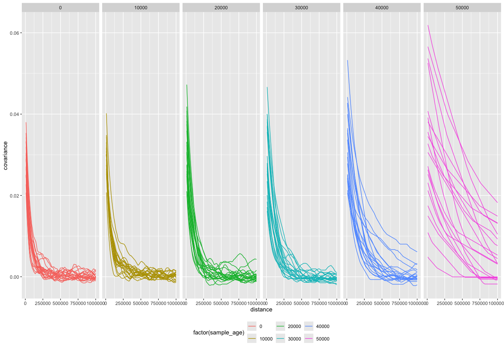

``` r
library(ggplot2)
library(readr)
library(dplyr)
#> 
#> Attaching package: 'dplyr'
#> The following objects are masked from 'package:stats':
#> 
#>     filter, lag
#> The following objects are masked from 'package:base':
#> 
#>     intersect, setdiff, setequal, union
library(tidyr)
library(cowplot)

library(plyranges)
#> Loading required package: BiocGenerics
#> 
#> Attaching package: 'BiocGenerics'
#> The following objects are masked from 'package:dplyr':
#> 
#>     combine, intersect, setdiff, union
#> The following objects are masked from 'package:stats':
#> 
#>     IQR, mad, sd, var, xtabs
#> The following objects are masked from 'package:base':
#> 
#>     anyDuplicated, aperm, append, as.data.frame, basename, cbind,
#>     colnames, dirname, do.call, duplicated, eval, evalq, Filter, Find,
#>     get, grep, grepl, intersect, is.unsorted, lapply, Map, mapply,
#>     match, mget, order, paste, pmax, pmax.int, pmin, pmin.int,
#>     Position, rank, rbind, Reduce, rownames, sapply, setdiff, sort,
#>     table, tapply, union, unique, unsplit, which.max, which.min
#> Loading required package: IRanges
#> Loading required package: S4Vectors
#> Loading required package: stats4
#> 
#> Attaching package: 'S4Vectors'
#> The following object is masked from 'package:tidyr':
#> 
#>     expand
#> The following objects are masked from 'package:dplyr':
#> 
#>     first, rename
#> The following object is masked from 'package:utils':
#> 
#>     findMatches
#> The following objects are masked from 'package:base':
#> 
#>     expand.grid, I, unname
#> 
#> Attaching package: 'IRanges'
#> The following objects are masked from 'package:dplyr':
#> 
#>     collapse, desc, slice
#> Loading required package: GenomicRanges
#> Loading required package: GenomeInfoDb
#> Warning: package 'GenomeInfoDb' was built under R version 4.3.3
#> 
#> Attaching package: 'plyranges'
#> The following object is masked from 'package:IRanges':
#> 
#>     slice
#> The following objects are masked from 'package:dplyr':
#> 
#>     between, n, n_distinct
#> The following object is masked from 'package:stats':
#> 
#>     filter
library(ggbio)
#> Registered S3 method overwritten by 'GGally':
#>   method from   
#>   +.gg   ggplot2
#> Need specific help about ggbio? try mailing 
#>  the maintainer or visit https://lawremi.github.io/ggbio/
#> 
#> Attaching package: 'ggbio'
#> The following objects are masked from 'package:ggplot2':
#> 
#>     geom_bar, geom_rect, geom_segment, ggsave, stat_bin, stat_identity,
#>     xlim
library(BSgenome.Hsapiens.UCSC.hg19)
#> Loading required package: BSgenome
#> Loading required package: Biostrings
#> Warning: package 'Biostrings' was built under R version 4.3.3
#> Loading required package: XVector
#> 
#> Attaching package: 'Biostrings'
#> The following object is masked from 'package:base':
#> 
#>     strsplit
#> Loading required package: BiocIO
#> Loading required package: rtracklayer
#> 
#> Attaching package: 'rtracklayer'
#> The following object is masked from 'package:BiocIO':
#> 
#>     FileForFormat

suppressPackageStartupMessages(source(here::here("utils.R")))
```

``` r
tracts_df <-
  read_tsv("data/sim_tracts.tsv") %>%
  group_by(name) %>%
  mutate(haplotype = dense_rank(node_id),
         chrom = paste0("chr1_", haplotype)) %>%
  ungroup()
#> Rows: 4280 Columns: 7
#> ── Column specification ────────────────────────────────────────────────────────
#> Delimiter: "\t"
#> chr (2): name, pop
#> dbl (5): sample_age, node_id, left, right, length
#> 
#> ℹ Use `spec()` to retrieve the full column specification for this data.
#> ℹ Specify the column types or set `show_col_types = FALSE` to quiet this message.

tracts_df
#> # A tibble: 4,280 × 9
#>    name  sample_age pop   node_id     left    right  length haplotype chrom 
#>    <chr>      <dbl> <chr>   <dbl>    <dbl>    <dbl>   <dbl>     <int> <chr> 
#>  1 EUR_1      50000 EUR         0 19127220 19527944  400724         1 chr1_1
#>  2 EUR_1      50000 EUR         0 50960983 51219943  258960         1 chr1_1
#>  3 EUR_1      50000 EUR         0 54542568 55565589 1023021         1 chr1_1
#>  4 EUR_1      50000 EUR         0 59782108 59938917  156809         1 chr1_1
#>  5 EUR_1      50000 EUR         0 95275454 96092356  816902         1 chr1_1
#>  6 EUR_1      50000 EUR         1   482833   887166  404333         2 chr1_2
#>  7 EUR_1      50000 EUR         1  9178348  9191865   13517         2 chr1_2
#>  8 EUR_1      50000 EUR         1 47755037 48715368  960331         2 chr1_2
#>  9 EUR_1      50000 EUR         1 62276039 62914084  638045         2 chr1_2
#> 10 EUR_1      50000 EUR         1 84342084 84432573   90489         2 chr1_2
#> # ℹ 4,270 more rows
```

<!-- ```{r} -->
<!-- metadata <- read_metadata() -->
<!-- tracts_df <- rbind(read_tracts("Modern"), read_tracts("Ancient")) -->
<!-- tracts_df <- select(metadata, name = sampleId, ageAverage, coverage) %>% -->
<!--   inner_join(tracts_df, by = c("name" = "ID")) %>% -->
<!--   dplyr::rename(left = start, right = end) -->
<!-- tracts_df <- tracts_df %>% filter(name == "Kostenki") %>% arrange(chrom, left, right) -->
<!-- tracts_df$chrom_id <- tracts_df$chrom -->
<!-- ``` -->

``` r
tracts_gr <- tracts_df %>%
  makeGRangesFromDataFrame(
    start.field = "left",
    end.field = "right",
    keep.extra.columns = TRUE,
    ignore.strand = TRUE,
    starts.in.df.are.0based = TRUE
  )
```

<!-- ```{r} -->
<!-- seqlengths(tracts_gr) <- seqlengths(BSgenome.Hsapiens.UCSC.hg19)[names(seqlengths(tracts_gr))] -->
<!-- genome(tracts_gr) <- "hg19" -->
<!-- ``` -->

``` r
seqlengths(tracts_gr) <- rep(100e6, 2)
```

``` r
tracts_gr
#> GRanges object with 4280 ranges and 6 metadata columns:
#>          seqnames            ranges strand |        name sample_age         pop
#>             <Rle>         <IRanges>  <Rle> | <character>  <numeric> <character>
#>      [1]   chr1_1 19127221-19527944      * |       EUR_1      50000         EUR
#>      [2]   chr1_1 50960984-51219943      * |       EUR_1      50000         EUR
#>      [3]   chr1_1 54542569-55565589      * |       EUR_1      50000         EUR
#>      [4]   chr1_1 59782109-59938917      * |       EUR_1      50000         EUR
#>      [5]   chr1_1 95275455-96092356      * |       EUR_1      50000         EUR
#>      ...      ...               ...    ... .         ...        ...         ...
#>   [4276]   chr1_2 84174414-84347352      * |      EUR_60          0         EUR
#>   [4277]   chr1_2 84385266-84501788      * |      EUR_60          0         EUR
#>   [4278]   chr1_2 86999164-87004998      * |      EUR_60          0         EUR
#>   [4279]   chr1_2 96215189-96313082      * |      EUR_60          0         EUR
#>   [4280]   chr1_2 96935176-96957114      * |      EUR_60          0         EUR
#>            node_id    length haplotype
#>          <numeric> <numeric> <integer>
#>      [1]         0    400724         1
#>      [2]         0    258960         1
#>      [3]         0   1023021         1
#>      [4]         0    156809         1
#>      [5]         0    816902         1
#>      ...       ...       ...       ...
#>   [4276]       119    172939         2
#>   [4277]       119    116523         2
#>   [4278]       119      5835         2
#>   [4279]       119     97894         2
#>   [4280]       119     21939         2
#>   -------
#>   seqinfo: 2 sequences from an unspecified genome
```

### Define positions of archaic ancestry informative sites

``` r
generate_info_sites <- function(tracts_gr, interval) {
  sites_grl <- lapply(seqlevels(tracts_gr), function(chrom) {
    positions <- seq(from = 1, to = seqlengths(tracts_gr)[chrom], by = interval)

    gr <- GRanges(seqnames = chrom, ranges = IRanges(start = positions, end = positions))
    mcols(gr)$index <- seq_len(length(gr))

    gr
  }) %>% GRangesList()
  seqlevels(sites_grl) <- seqlevels(tracts_gr)
  seqlengths(sites_grl) <- seqlengths(tracts_gr)

  sites_grl
}
```

### Define pairs of sites at given distances

``` r
# Generate list of indices of all pairs of loci at given distances
# (one element of the list for each distance bin)
collect_pairs <- function(sites_grl, distances, ncores = parallel::detectCores()) {

  chr_pairs <- lapply(seqlevels(sites_grl), function(chrom) {

    sites_gr <- sites_grl[seqlevels(sites_grl) == chrom, ] %>% unlist

    pairs <- parallel::mclapply(distances, function(distance) {

        pair1 <- c()
        pair2 <- c()

        # iterate through each site one by one...
        for (i in sites_gr$index) {
          index1 <- i
          # ... and find the index of the first site that is at a given distance
          index2 <- sites_gr[start(sites_gr) >= start(sites_gr[i]) + distance]$index[1]

          if (is.na(index2)) {
            if (seqlengths(sites_gr)[chrom] < start(sites_gr[i]) + distance  + distance / 10)
              break
            else
              next
          }

          # otherwise record the indices of the pair of sites and proceed with searching
          # for the next pair
          pair1 <- c(pair1, index1)
          pair2 <- c(pair2, index2)
        }

        list(pair1 = pair1, pair2 = pair2)

      }, mc.cores = ncores)

    pairs

  })

  names(chr_pairs) <- seqlevels(sites_grl)
  chr_pairs
}
```

``` r
interval <- 10e3

sites_grl <- generate_info_sites(tracts_gr, interval = interval)
distances <- seq(interval, 1e6, by = interval)

# unlink("dating_LD_pairs_regular.rds")
if (file.exists("dating_LD_pairs_regular.rds")) {
  pairs <- readRDS("dating_LD_pairs.rds")
} else {
  tstart <- Sys.time()
  pairs <- collect_pairs(sites_grl, distances)
  tend <- Sys.time()

  print(tend - tstart)
  saveRDS(pairs, "dating_LD_pairs_regular.rds")
}
#> Time difference of 8.553553 mins
```

### Compute covariance in a given individual

``` r
tracts_gr$sample_age %>% unique
#> [1] 50000 40000 30000 20000 10000     0
tracts_gr$name %>% unique
#>  [1] "EUR_1"  "EUR_2"  "EUR_3"  "EUR_4"  "EUR_5"  "EUR_6"  "EUR_7"  "EUR_8" 
#>  [9] "EUR_9"  "EUR_10" "EUR_11" "EUR_12" "EUR_13" "EUR_14" "EUR_15" "EUR_16"
#> [17] "EUR_17" "EUR_18" "EUR_19" "EUR_20" "EUR_21" "EUR_22" "EUR_23" "EUR_24"
#> [25] "EUR_25" "EUR_26" "EUR_27" "EUR_28" "EUR_29" "EUR_30" "EUR_31" "EUR_32"
#> [33] "EUR_33" "EUR_34" "EUR_35" "EUR_36" "EUR_37" "EUR_38" "EUR_39" "EUR_40"
#> [41] "EUR_41" "EUR_42" "EUR_43" "EUR_44" "EUR_45" "EUR_46" "EUR_47" "EUR_48"
#> [49] "EUR_49" "EUR_50" "EUR_51" "EUR_52" "EUR_53" "EUR_54" "EUR_55" "EUR_56"
#> [57] "EUR_57" "EUR_58" "EUR_59" "EUR_60"
```

``` r
compute_covariances <- function(tracts_gr, sites_grl, pairs) {
  lapply(seqlevels(sites_grl), function(chrom) {

    sites_gr <- sites_grl[seqlevels(sites_grl) == chrom, ] %>% unlist

    parallel::mclapply(unique(tracts_gr$name), function(name) {
      
      ind_tracts_gr <- tracts_gr %>% filter(name == !!name, seqnames == chrom)
      ind_sites_gr <- sites_gr
      
      # mark sites falling within an introgressed tract
      tract_overlaps <- queryHits(findOverlaps(ind_sites_gr, ind_tracts_gr))
      mcols(ind_sites_gr)$neand <- FALSE
      mcols(ind_sites_gr[tract_overlaps])$neand <- TRUE
      mcols(ind_sites_gr)$neand <- as.integer(mcols(ind_sites_gr)$neand)
    
      covariances <- sapply(seq_along(distances), function(i) {
        sites1 <- ind_sites_gr[pairs[[chrom]][[i]]$pair1]$neand
        sites2 <- ind_sites_gr[pairs[[chrom]][[i]]$pair2]$neand
        cov(sites1, sites2)
      })

      tibble(
        chrom = chrom,
        name = name,
        sample_age = unique(ind_tracts_gr$sample_age),
        distance = distances,
        covariance = covariances
      )
    }, mc.cores = detectCores()) %>% do.call(rbind, .)
  }) %>% do.call(rbind, .)
}
```

``` r
cov_df <- compute_covariances(tracts_gr, sites_grl, pairs)
```

``` r
cov_df %>%
ggplot() +
  geom_line(aes(distance, covariance, color = factor(sample_age), group = interaction(chrom, name))) +
  facet_grid(~ sample_age) +
  coord_cartesian(xlim = c(0, max(distances))) +
  theme(legend.position = "bottom")
```

<!-- -->

``` r
tracts_gr %>%
as_tibble %>%
ggplot() +
  geom_density(aes(length, color = factor(sample_age), group = name)) +
  facet_grid(. ~ sample_age) +
  coord_cartesian(xlim = c(0, max(distances)))
```

<!-- -->

``` r
chrom <- "chr1_2"
name <- "EUR_10"

sites_gr <- sites_grl[seqlevels(sites_grl) == chrom, ] %>% unlist
ind_tracts_gr <- tracts_gr %>% filter(name == !!name, seqnames == chrom)
ind_sites_gr <- sites_gr

# mark sites falling within an introgressed tract
tract_overlaps <- queryHits(findOverlaps(ind_sites_gr, ind_tracts_gr))
mcols(ind_sites_gr)$neand <- FALSE
mcols(ind_sites_gr[tract_overlaps])$neand <- TRUE
mcols(ind_sites_gr)$neand <- as.integer(mcols(ind_sites_gr)$neand)
    
ggplot() +
  geom_rect(data = as.data.frame(ind_tracts_gr), aes(xmin = start, xmax = end, ymin = 0.1, ymax = 1.5), fill = "blue") +
  geom_point(data = as.data.frame(filter(ind_sites_gr, neand == 1)), aes(x = start, y = 0.05), size = 0.1, color = "red") +
  geom_point(data = as.data.frame(ind_sites_gr), aes(x = start, y = 0), size = 0.1, alpha = 0.05) +
  scale_x_continuous(labels = scales::comma) +
  expand_limits(x = 0) +
  theme_minimal() +
  theme(axis.text.y = element_blank(), axis.title.y = element_blank(), axis.ticks.y = element_blank(), panel.grid = element_blank())
```

<!-- -->
