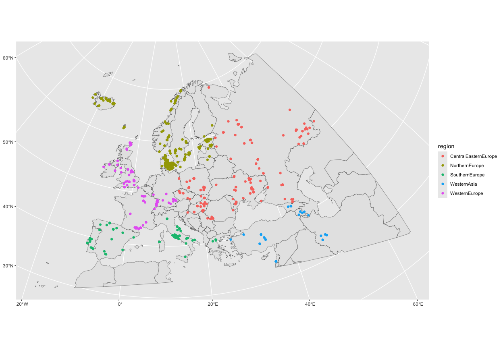
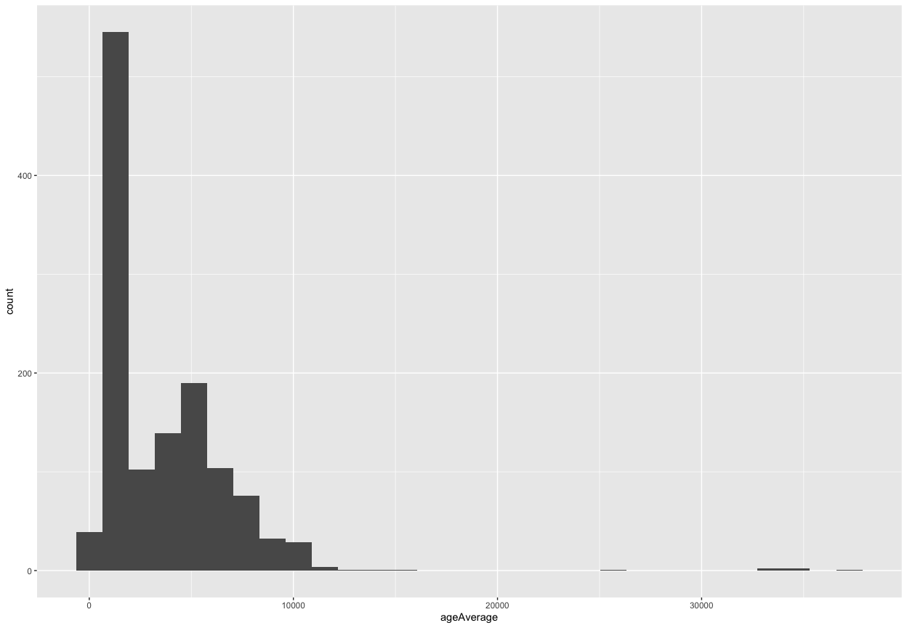
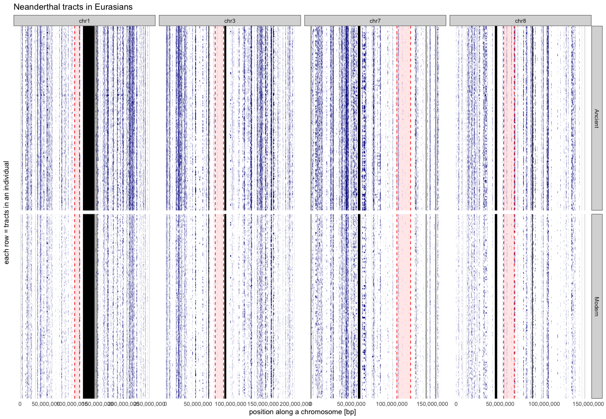
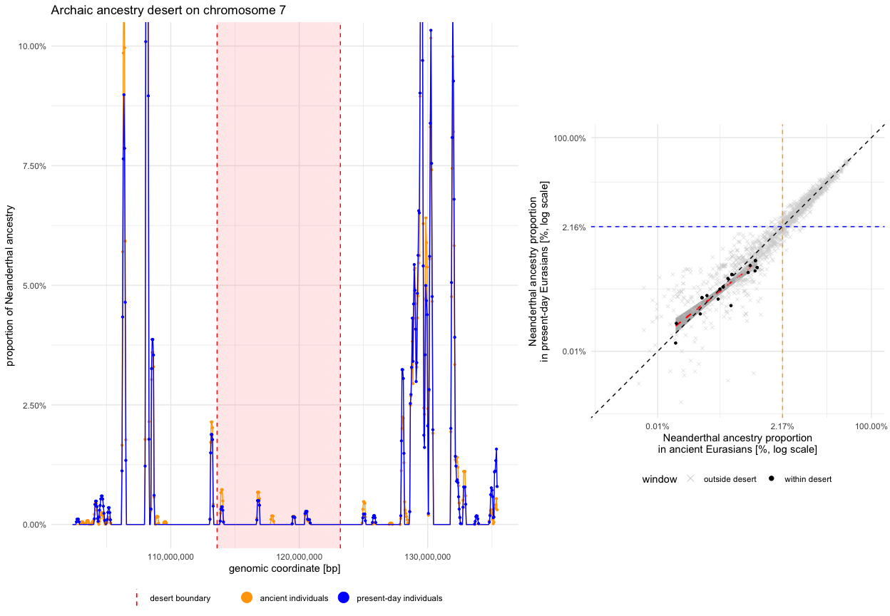
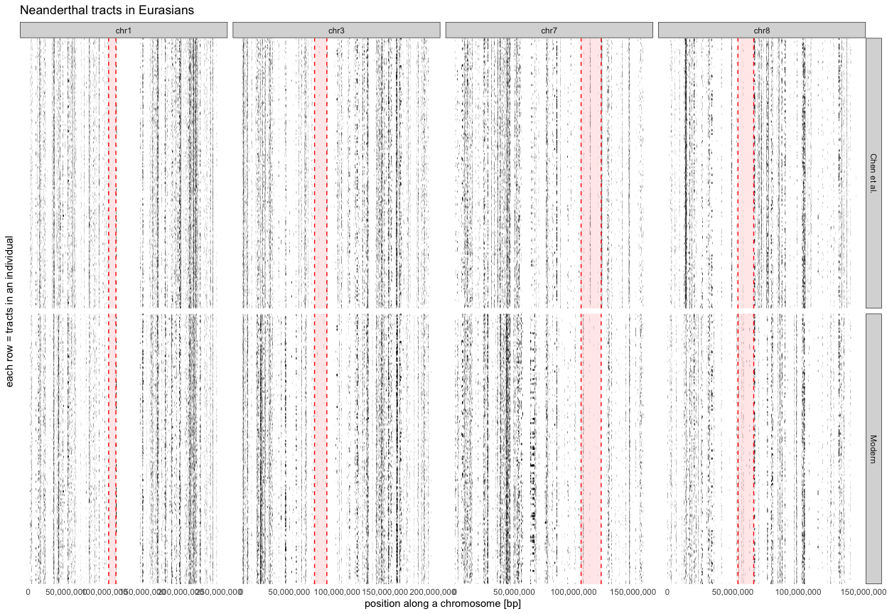
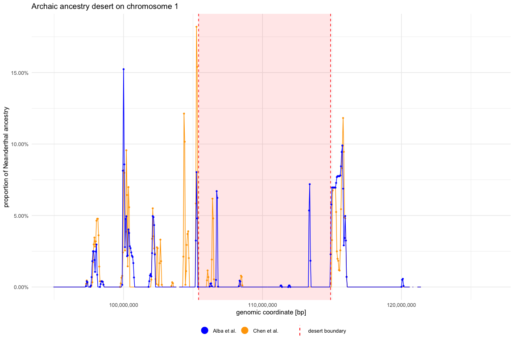
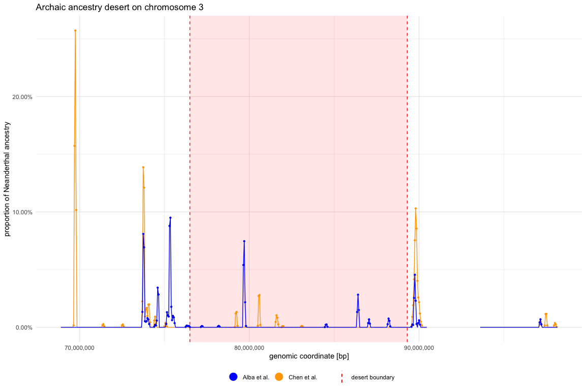
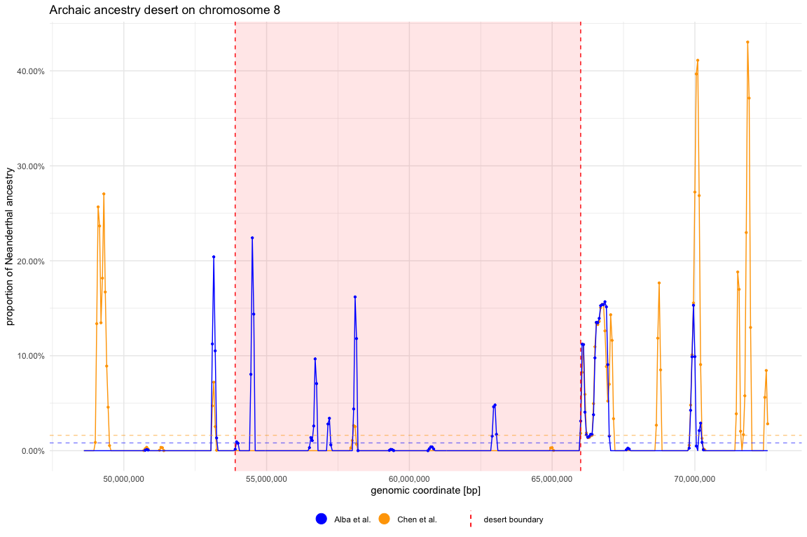

``` r
suppressPackageStartupMessages({
  library(readr)
  library(dplyr)
  library(tidyr)
  library(ggplot2)
  library(sf)
  library(rnaturalearth)

  library(GenomicRanges)
  library(ggbio)
  library(plyranges)
})
#> Warning: package 'GenomeInfoDb' was built under R version 4.3.3

source(here::here("utils.R"))
```

``` r
# IBDmix desert coordinates from Table S8 of Chan et al., 202
# (https://ars.els-cdn.com/content/image/1-s2.0-S0092867420300593-mmc1.pdf)
# (https://ars.els-cdn.com/content/image/1-s2.0-S0092867420300593-figs4_lrg.jpg)

deserts_df <- tribble(
  ~chrom, ~start_ss, ~end_ss,   ~start_ibdmix, ~end_ibdmix,
  "chr1", 102200000, 114900000, 105400000,     120600000,
  "chr3", 76500000,  90500000,  74100000,      89300000,
  "chr7", 106300000, 124700000, 106200000,     123200000,
  "chr8", 53900000,  66000000,  49400000,      66500000
) %>% pivot_longer(cols = c(starts_with("start_"), starts_with("end_")),
                   names_to = c(".value", "method"), names_sep = "_")

# convert S* and IBDmix coordinates above into GRanges objects
ss_deserts_gr <- filter(deserts_df, method == "ss") %>% makeGRangesFromDataFrame()
ibdmix_deserts_gr <- filter(deserts_df, method == "ibdmix") %>% makeGRangesFromDataFrame()

# get intersect of Neanderthal-only deserts inferred by both methods
deserts_gr <- pintersect(ss_deserts_gr, ibdmix_deserts_gr)
```

``` r
# combined Neanderthal and Denisovan deserts -- Table S9 on page 51 of
# https://www.science.org/doi/suppl/10.1126/science.aad9416/suppl_file/vernot-sm.pdf
ss2_deserts_gr <- tribble(
  ~chrom, ~start, ~end,
  "chr1", 104000000, 114900000,
  "chr3", 76500000, 90500000,
  "chr7", 113600000, 124700000,
  "chr8", 54500000, 65400000
) %>% makeGRangesFromDataFrame()

# get intersect of S* Neanderthal AND Denisovan deserts and IBDmix Neanderthal deserts
deserts2_gr <- pintersect(ss2_deserts_gr, ibdmix_deserts_gr)
```

``` r
ss_deserts_gr$width <- width(ss_deserts_gr) / 1e6
ibdmix_deserts_gr$width <- width(ibdmix_deserts_gr) / 1e6
deserts_gr$width <- width(deserts_gr) / 1e6

ss2_deserts_gr$width <- width(ss2_deserts_gr) / 1e6
deserts2_gr$width <- width(deserts2_gr) / 1e6
```

``` r
ss_deserts_gr
#> GRanges object with 4 ranges and 1 metadata column:
#>       seqnames              ranges strand |     width
#>          <Rle>           <IRanges>  <Rle> | <numeric>
#>   [1]     chr1 102200000-114900000      * |      12.7
#>   [2]     chr3   76500000-90500000      * |      14.0
#>   [3]     chr7 106300000-124700000      * |      18.4
#>   [4]     chr8   53900000-66000000      * |      12.1
#>   -------
#>   seqinfo: 4 sequences from an unspecified genome; no seqlengths
ibdmix_deserts_gr
#> GRanges object with 4 ranges and 1 metadata column:
#>       seqnames              ranges strand |     width
#>          <Rle>           <IRanges>  <Rle> | <numeric>
#>   [1]     chr1 105400000-120600000      * |      15.2
#>   [2]     chr3   74100000-89300000      * |      15.2
#>   [3]     chr7 106200000-123200000      * |      17.0
#>   [4]     chr8   49400000-66500000      * |      17.1
#>   -------
#>   seqinfo: 4 sequences from an unspecified genome; no seqlengths
deserts_gr
#> GRanges object with 4 ranges and 2 metadata columns:
#>       seqnames              ranges strand |       hit     width
#>          <Rle>           <IRanges>  <Rle> | <logical> <numeric>
#>   [1]     chr1 105400000-114900000      * |      TRUE       9.5
#>   [2]     chr3   76500000-89300000      * |      TRUE      12.8
#>   [3]     chr7 106300000-123200000      * |      TRUE      16.9
#>   [4]     chr8   53900000-66000000      * |      TRUE      12.1
#>   -------
#>   seqinfo: 4 sequences from an unspecified genome; no seqlengths

ss2_deserts_gr
#> GRanges object with 4 ranges and 1 metadata column:
#>       seqnames              ranges strand |     width
#>          <Rle>           <IRanges>  <Rle> | <numeric>
#>   [1]     chr1 104000000-114900000      * |      10.9
#>   [2]     chr3   76500000-90500000      * |      14.0
#>   [3]     chr7 113600000-124700000      * |      11.1
#>   [4]     chr8   54500000-65400000      * |      10.9
#>   -------
#>   seqinfo: 4 sequences from an unspecified genome; no seqlengths
deserts2_gr
#> GRanges object with 4 ranges and 2 metadata columns:
#>       seqnames              ranges strand |       hit     width
#>          <Rle>           <IRanges>  <Rle> | <logical> <numeric>
#>   [1]     chr1 105400000-114900000      * |      TRUE       9.5
#>   [2]     chr3   76500000-89300000      * |      TRUE      12.8
#>   [3]     chr7 113600000-123200000      * |      TRUE       9.6
#>   [4]     chr8   54500000-65400000      * |      TRUE      10.9
#>   -------
#>   seqinfo: 4 sequences from an unspecified genome; no seqlengths
```

In the visualizations below, we will define archaic deserts as the
intersection of Neanderthal deserts obtained from S\* and Neanderthal
deserts obtained by IBDmix:

``` r
# deserts_gr <- deserts2_gr

desert_coords <- deserts_gr %>% as.data.frame() %>% select(chrom = seqnames, start, end)
desert_coords
#>   chrom     start       end
#> 1  chr1 105400000 114900000
#> 2  chr3  76500000  89300000
#> 3  chr7 106300000 123200000
#> 4  chr8  53900000  66000000
```

## Load and inspect GeoGenetics metadata

``` r
metadata <- read_metadata()
#> Rows: 4172 Columns: 32
#> ── Column specification ────────────────────────────────────────────────────────
#> Delimiter: "\t"
#> chr (22): sampleId, popId, site, country, region, groupLabel, groupAge, flag...
#> dbl (10): shapeA, latitude, longitude, age14C, ageHigh, ageLow, ageAverage, ...
#> 
#> ℹ Use `spec()` to retrieve the full column specification for this data.
#> ℹ Specify the column types or set `show_col_types = FALSE` to quiet this message.
```

``` r
glimpse(metadata)
#> Rows: 1,772
#> Columns: 32
#> $ sampleId         <chr> "NA20502", "NA20503", "NA20504", "NA20505", "NA20506"…
#> $ popId            <chr> "TSI", "TSI", "TSI", "TSI", "TSI", "TSI", "TSI", "TSI…
#> $ site             <chr> NA, NA, NA, NA, NA, NA, NA, NA, NA, NA, NA, NA, NA, N…
#> $ country          <chr> "Italy", "Italy", "Italy", "Italy", "Italy", "Italy",…
#> $ region           <chr> "SouthernEurope", "SouthernEurope", "SouthernEurope",…
#> $ groupLabel       <chr> "TSI", "TSI", "TSI", "TSI", "TSI", "TSI", "TSI", "TSI…
#> $ groupAge         <chr> "Modern", "Modern", "Modern", "Modern", "Modern", "Mo…
#> $ flag             <chr> "0", "0", "0", "0", "0", "0", "0", "0", "0", "0", "0"…
#> $ shapeA           <dbl> 5, 5, 5, 5, 5, 5, 5, 5, 5, 5, 5, 5, 5, 5, 5, 5, 5, 5,…
#> $ colorA           <chr> NA, NA, NA, NA, NA, NA, NA, NA, NA, NA, NA, NA, NA, N…
#> $ latitude         <dbl> NA, NA, NA, NA, NA, NA, NA, NA, NA, NA, NA, NA, NA, N…
#> $ longitude        <dbl> NA, NA, NA, NA, NA, NA, NA, NA, NA, NA, NA, NA, NA, N…
#> $ callset          <chr> "sg.diploid", "sg.diploid", "sg.diploid", "sg.diploid…
#> $ dataSource       <chr> "1000g", "1000g", "1000g", "1000g", "1000g", "1000g",…
#> $ age14C           <dbl> NA, NA, NA, NA, NA, NA, NA, NA, NA, NA, NA, NA, NA, N…
#> $ ageHigh          <dbl> NA, NA, NA, NA, NA, NA, NA, NA, NA, NA, NA, NA, NA, N…
#> $ ageLow           <dbl> NA, NA, NA, NA, NA, NA, NA, NA, NA, NA, NA, NA, NA, N…
#> $ ageAverage       <dbl> 0, 0, 0, 0, 0, 0, 0, 0, 0, 0, 0, 0, 0, 0, 0, 0, 0, 0,…
#> $ datingSource     <chr> NA, NA, NA, NA, NA, NA, NA, NA, NA, NA, NA, NA, NA, N…
#> $ coverage         <dbl> Inf, Inf, Inf, Inf, Inf, Inf, Inf, Inf, Inf, Inf, Inf…
#> $ sex              <chr> "XX", "XX", "XX", "XX", "XX", "XX", "XX", "XY", "XY",…
#> $ hgMT             <chr> NA, NA, NA, NA, NA, NA, NA, NA, NA, NA, NA, NA, NA, N…
#> $ gpAvg            <dbl> NA, NA, NA, NA, NA, NA, NA, NA, NA, NA, NA, NA, NA, N…
#> $ ageRaw           <chr> NA, NA, NA, NA, NA, NA, NA, NA, NA, NA, NA, NA, NA, N…
#> $ clusterId        <chr> NA, NA, NA, NA, NA, NA, NA, NA, NA, NA, NA, NA, NA, N…
#> $ clusterIBDGlobal <chr> "Europe_modern", "Europe_modern", "Europe_modern", "E…
#> $ clusterIBDFine   <chr> "TSI", "TSI", "TSI", "TSI", "TSI", "TSI", "TSI", "TSI…
#> $ hgYMajor         <chr> NA, NA, NA, NA, NA, NA, NA, NA, NA, NA, NA, NA, NA, N…
#> $ hgYMinor         <chr> NA, NA, NA, NA, NA, NA, NA, NA, NA, NA, NA, NA, NA, N…
#> $ color            <chr> "seagreen4", "seagreen4", "seagreen4", "seagreen4", "…
#> $ clusterAlias     <chr> "Europe_modern", "Europe_modern", "Europe_modern", "E…
#> $ shape            <dbl> 5, 5, 5, 5, 5, 5, 5, 5, 5, 5, 5, 5, 5, 5, 5, 5, 5, 5,…
```

Plot the spatial distribution of all ancient samples in the imputed
data:

``` r
world <- ne_countries(scale = "medium", returnclass = "sf")
sf::st_agr(world) <- "constant"
bbox <- st_as_sfc(st_bbox(c(xmin = -25, xmax = 65, ymin = 25, ymax = 70), crs = st_crs(world)))
western_eurasia <- st_crop(st_make_valid(world), bbox)

metadata %>%
  filter(!is.na(latitude) & !is.na(longitude)) %>%
  st_as_sf(coords = c("longitude", "latitude")) %>%
  st_set_crs(4326) %>%
  ggplot() +
    geom_sf(data = western_eurasia) +
    geom_sf(aes(color = region)) +
    coord_sf(crs = 3035)
```

<!-- -->

Out of the various “age” columns in the GeoGenetics metadata, which one
is actually usable?

``` r
filter(metadata, groupAge == "Ancient") %>%
  summarise_at(c("age14C", "ageAverage", "ageRaw"),
               list(total = ~length(.), missing = ~sum(is.na(.x)), prop = ~mean(is.na(.x)))) %>%
  pivot_longer(cols = everything(), names_to = "name") %>%
  separate(name, into = c("measure", "type"), sep = "_", extra = "merge")
#> # A tibble: 9 × 3
#>   measure    type       value
#>   <chr>      <chr>      <dbl>
#> 1 age14C     total   1269    
#> 2 ageAverage total   1269    
#> 3 ageRaw     total   1269    
#> 4 age14C     missing  700    
#> 5 ageAverage missing    0    
#> 6 ageRaw     missing 1216    
#> 7 age14C     prop       0.552
#> 8 ageAverage prop       0    
#> 9 ageRaw     prop       0.958
```

Looks like `ageAverage` has a value for every individual:

``` r
metadata %>%
  filter(groupAge == "Ancient") %>%
  ggplot() +
  geom_histogram(aes(ageAverage))
#> `stat_bin()` using `bins = 30`. Pick better value with `binwidth`.
```

<!-- -->

## Inspect Neanderthal tracts in ancient and present-day individuals

``` r
tracts <- rbind(
  read_tracts("Modern", metadata),
  read_tracts("Ancient", metadata)
)
#> Rows: 1272453 Columns: 26
#> ── Column specification ────────────────────────────────────────────────────────
#> Delimiter: "\t"
#> chr  (8): ID, population, superpop, region, clusterAlias, pop, groupAge, arc...
#> dbl (17): ageAverage, chrom, start, end, slod, sites, positive_lods, negativ...
#> lgl  (1): anc
#> 
#> ℹ Use `spec()` to retrieve the full column specification for this data.
#> ℹ Specify the column types or set `show_col_types = FALSE` to quiet this message.
#> Rows: 1272453 Columns: 26
#> ── Column specification ────────────────────────────────────────────────────────
#> Delimiter: "\t"
#> chr  (8): ID, population, superpop, region, clusterAlias, pop, groupAge, arc...
#> dbl (17): ageAverage, chrom, start, end, slod, sites, positive_lods, negativ...
#> lgl  (1): anc
#> 
#> ℹ Use `spec()` to retrieve the full column specification for this data.
#> ℹ Specify the column types or set `show_col_types = FALSE` to quiet this message.

tracts
#> # A tibble: 706,441 × 6
#>    ID      chrom     start       end length set   
#>    <chr>   <chr>     <dbl>     <dbl>  <dbl> <chr> 
#>  1 HG00096 chr2  230587448 230666898  79450 Modern
#>  2 HG00096 chr10  64618340  64832999 214659 Modern
#>  3 HG00096 chr4   27175143  27250293  75150 Modern
#>  4 HG00096 chr4   10555535  10667610 112075 Modern
#>  5 HG00096 chr4   13699206  13788189  88983 Modern
#>  6 HG00096 chr2  220777562 220862409  84847 Modern
#>  7 HG00096 chr4    5744094   5795412  51318 Modern
#>  8 HG00096 chr10  59975686  60034981  59295 Modern
#>  9 HG00096 chr10  61792790  61851906  59116 Modern
#> 10 HG00096 chr2  227251112 227379627 128515 Modern
#> # ℹ 706,431 more rows
```

``` r
tracts_df <- select(metadata, sampleId, ageAverage, coverage) %>% inner_join(tracts, by = c("sampleId" = "ID"))

tracts_df$age_group <- cut(
  tracts_df$ageAverage,
  breaks = c(Inf, 20e3, 10e3, 5e3, 100, 0),
)

group_levels <- levels(tracts_df$age_group)

tracts_df <- tracts_df %>%
  mutate(
    age_group = as.character(age_group),
    age_group = ifelse(is.na(age_group), "present-day", age_group),
    age_group = factor(age_group, levels = c("present-day", group_levels))
  )
```

Convert the IBDmix tracts data frame to `GRanges`:

``` r
library(BSgenome.Hsapiens.UCSC.hg19)
#> Loading required package: BSgenome
#> Loading required package: Biostrings
#> Warning: package 'Biostrings' was built under R version 4.3.3
#> Loading required package: XVector
#> 
#> Attaching package: 'Biostrings'
#> The following object is masked from 'package:base':
#> 
#>     strsplit
#> Loading required package: BiocIO
#> Loading required package: rtracklayer
#> 
#> Attaching package: 'rtracklayer'
#> The following object is masked from 'package:BiocIO':
#> 
#>     FileForFormat

tracts_gr <- tracts %>% makeGRangesFromDataFrame(keep.extra.columns = TRUE)

seqlengths(tracts_gr) <- seqlengths(BSgenome.Hsapiens.UCSC.hg19)[names(seqlengths(tracts_gr))]
genome(tracts_gr) <- "hg19"

tracts_gr
#> GRanges object with 706441 ranges and 3 metadata columns:
#>            seqnames              ranges strand |          ID    length
#>               <Rle>           <IRanges>  <Rle> | <character> <numeric>
#>        [1]     chr2 230587448-230666898      * |     HG00096     79450
#>        [2]    chr10   64618340-64832999      * |     HG00096    214659
#>        [3]     chr4   27175143-27250293      * |     HG00096     75150
#>        [4]     chr4   10555535-10667610      * |     HG00096    112075
#>        [5]     chr4   13699206-13788189      * |     HG00096     88983
#>        ...      ...                 ...    ... .         ...       ...
#>   [706437]    chr10 133049787-133108620      * |     YGS-B-2     58833
#>   [706438]     chr7 128914309-129062633      * |     YGS-B-2    148324
#>   [706439]    chr12   95113121-95323772      * |     YGS-B-2    210651
#>   [706440]     chr3   28709795-28766423      * |     YGS-B-2     56628
#>   [706441]    chr12   96050068-96129227      * |     YGS-B-2     79159
#>                    set
#>            <character>
#>        [1]      Modern
#>        [2]      Modern
#>        [3]      Modern
#>        [4]      Modern
#>        [5]      Modern
#>        ...         ...
#>   [706437]     Ancient
#>   [706438]     Ancient
#>   [706439]     Ancient
#>   [706440]     Ancient
#>   [706441]     Ancient
#>   -------
#>   seqinfo: 22 sequences from hg19 genome
```

### Fetch gaps from USCS

``` r
library(ggbio)
library(rtracklayer)
library(plyranges)

mySession <- browserSession()
genome(mySession) <- "hg19"
query <- ucscTableQuery(mySession, table = "gap")

# gap table columns: https://genome.ucsc.edu/cgi-bin/hgTables?db=hg38&hgta_group=map&hgta_track=gap&hgta_table=gap&hgta_doSchema=describe+table+schema
gaps <- getTable(query) %>%
  dplyr::filter(grepl("chr\\d+$", chrom)) %>% as_tibble()

gaps_gr <- makeGRangesFromDataFrame(gaps, starts.in.df.are.0based = TRUE, keep.extra.columns = TRUE, ignore.strand = TRUE)
seqinfo(gaps_gr) <- seqinfo(tracts_gr)

gaps_gr
#> GRanges object with 313 ranges and 6 metadata columns:
#>         seqnames              ranges strand |       bin        ix           n
#>            <Rle>           <IRanges>  <Rle> | <numeric> <numeric> <character>
#>     [1]     chr1 124535435-142535434      * |         0      1271           N
#>     [2]     chr1 121535435-124535434      * |        23      1270           N
#>     [3]     chr1     3845269-3995268      * |        76        47           N
#>     [4]     chr1   13219913-13319912      * |        85       154           N
#>     [5]     chr1   17125659-17175658      * |        89       196           N
#>     ...      ...                 ...    ... .       ...       ...         ...
#>   [309]     chr2 149690583-149790582      * |      1727      1221           N
#>   [310]     chr2 234003742-234053741      * |      2370      1942           N
#>   [311]     chr2 239801979-239831978      * |      2414      1992           N
#>   [312]     chr2 240784133-240809132      * |      2422      2001           N
#>   [313]     chr2 243189374-243199373      * |      2440      2027           N
#>              size            type      bridge
#>         <numeric>     <character> <character>
#>     [1]   1.8e+07 heterochromatin          no
#>     [2]   3.0e+06      centromere          no
#>     [3]   1.5e+05          contig          no
#>     [4]   1.0e+05          contig          no
#>     [5]   5.0e+04           clone         yes
#>     ...       ...             ...         ...
#>   [309]    100000          contig          no
#>   [310]     50000          contig          no
#>   [311]     30000          contig          no
#>   [312]     25000          contig          no
#>   [313]     10000        telomere          no
#>   -------
#>   seqinfo: 22 sequences from hg19 genome
```

``` r
gaps_gr %>%
  filter(seqnames %in% seqnames(deserts_gr)) %>%
  autoplot(aes(fill = type), color = NA) +
  theme_bw() +
  theme(panel.grid = element_blank(), legend.position = "bottom")
#> Warning: The `facets` argument of `facet_grid()` is deprecated as of ggplot2 2.2.0.
#> ℹ Please use the `rows` argument instead.
#> ℹ The deprecated feature was likely used in the ggbio package.
#>   Please report the issue at <https://github.com/lawremi/ggbio/issues>.
#> This warning is displayed once every 8 hours.
#> Call `lifecycle::last_lifecycle_warnings()` to see where this warning was
#> generated.
```

<!-- -->

``` r
subtracts_df <- tracts %>% filter(chrom %in% as.character(seqnames(deserts_gr)))
subgaps_df <- gaps_gr %>% as_tibble() %>% dplyr::rename(chrom = seqnames) %>% filter(chrom %in% as.character(seqnames(deserts_gr)))

ggplot() +
  geom_segment(subtracts_df, aes(x = start, xend = end, y = ID, yend = ID), linewidth = 1, color = "darkblue") +
  geom_rect(data = desert_coords, aes(xmin = start, xmax = end, ymin = -Inf, ymax = Inf),
            inherit.aes = FALSE, fill = "red", alpha = 0.1) +
  geom_rect(data = subgaps_df, aes(xmin = start, xmax = end, ymin = -Inf, ymax = Inf),
            inherit.aes = FALSE, fill = "black") +
  geom_vline(data = desert_coords, aes(xintercept = start), linetype = "dashed", color = "red") +
  geom_vline(data = desert_coords, aes(xintercept = end), linetype = "dashed", color = "red") +
  labs(x = "position along a chromosome [bp]", y = "each row = tracts in an individual") +
  theme_bw() +
  theme(
    axis.text.y = element_blank(),
    axis.ticks = element_blank(),
    panel.border = element_blank(),
    panel.grid = element_blank()
  ) +
  scale_x_continuous(labels = scales::comma) +
  facet_grid(set ~ chrom, scales = "free") +
  ggtitle("Neanderthal tracts in Eurasians")
```

<!-- -->

``` r
ggplot2::ggsave(paste0("deserts_1+3+7+8.pdf"), width = 13, height = 7)
```

### Analyse tracts in windows

``` r
windows_gr <- generate_windows(gaps_gr, window_size = 100e3, step_size = 50e3)
# windows_gr <- filter(windows_gr, seqnames == "chr7")

# mark windows falling within archaic deserts
windows_gr$within_desert <- FALSE
windows_gr[queryHits(findOverlaps(windows_gr, deserts_gr))]$within_desert <- TRUE

ancestry_modern_gr <- filter(tracts_gr, set == "Modern") %>% compute_ancestry(windows_gr)
ancestry_ancient_gr <- filter(tracts_gr, set == "Ancient") %>% compute_ancestry(windows_gr)

ancestry_gr <- windows_gr
ancestry_gr$modern <- ancestry_modern_gr$coverage
ancestry_gr$ancient <- ancestry_ancient_gr$coverage

ancestry_gr
#> GRanges object with 57611 ranges and 5 metadata columns:
#>           seqnames            ranges strand |  midpoint       gap within_desert
#>              <Rle>         <IRanges>  <Rle> | <numeric> <logical>     <logical>
#>       [1]     chr1          1-100000      * |   50000.5      TRUE         FALSE
#>       [2]     chr1      50001-150000      * |  100000.5     FALSE         FALSE
#>       [3]     chr1     100001-200000      * |  150000.5      TRUE         FALSE
#>       [4]     chr1     150001-250000      * |  200000.5      TRUE         FALSE
#>       [5]     chr1     200001-300000      * |  250000.5      TRUE         FALSE
#>       ...      ...               ...    ... .       ...       ...           ...
#>   [57607]    chr22 51050001-51150000      * |  51100000     FALSE         FALSE
#>   [57608]    chr22 51100001-51200000      * |  51150000     FALSE         FALSE
#>   [57609]    chr22 51150001-51250000      * |  51200000      TRUE         FALSE
#>   [57610]    chr22 51200001-51300000      * |  51250000      TRUE         FALSE
#>   [57611]    chr22 51250001-51304566      * |  51277284      TRUE         FALSE
#>              modern   ancient
#>           <numeric> <numeric>
#>       [1]        NA        NA
#>       [2]         0         0
#>       [3]        NA        NA
#>       [4]        NA        NA
#>       [5]        NA        NA
#>       ...       ...       ...
#>   [57607] 0.0406143 0.0220573
#>   [57608] 0.0255985 0.0136731
#>   [57609]        NA        NA
#>   [57610]        NA        NA
#>   [57611]        NA        NA
#>   -------
#>   seqinfo: 22 sequences from hg19 genome
```

Average Neanderthal ancestry proportion across all windows in ancient
and present-day individuals:

``` r
ancestry_gr %>%
  as_tibble() %>%
  summarise(
    neand_ancient = mean(ancient, na.rm = TRUE),
    neand_modern = mean(modern, na.rm = TRUE)
  )
#> # A tibble: 1 × 2
#>   neand_ancient neand_modern
#>           <dbl>        <dbl>
#> 1        0.0221       0.0221
```

Average Neanderthal ancestry proportion across all windows in ancient
and present-day individuals **within desert regions**:

``` r
filter(ancestry_gr, within_desert) %>%
  as_tibble() %>%
  group_by(seqnames) %>%
  summarise(
    desert_ancient = mean(ancient, na.rm = TRUE),
    desert_modern = mean(modern, na.rm = TRUE)
  )
#> # A tibble: 4 × 3
#>   seqnames desert_ancient desert_modern
#>   <fct>             <dbl>         <dbl>
#> 1 chr1            0.00158      0.00167 
#> 2 chr3            0.00101      0.000966
#> 3 chr7            0.00492      0.00414 
#> 4 chr8            0.00436      0.00513
```

``` r
ancestry_gr %>%
  as_tibble() %>%
  filter(within_desert) %>%
  dplyr::rename(chrom = seqnames) %>%
  mutate(chrom = as.character(chrom)) %>%
  group_by(chrom) %>% 
  summarise(
    mean(ancient == 0 & modern > 0),
    mean(ancient > 0 & modern == 0),
    mean((ancient == 0 & modern == 0) | (ancient > 0 & modern > 0))
  ) %>%
  pivot_longer(cols = contains("mean"), values_to = "proportion of sites") %>%
  split(.$chrom)
#> $chr1
#> # A tibble: 3 × 3
#>   chrom name                                               `proportion of sites`
#>   <chr> <chr>                                                              <dbl>
#> 1 chr1  mean(ancient == 0 & modern > 0)                                   0.0208
#> 2 chr1  mean(ancient > 0 & modern == 0)                                   0.0156
#> 3 chr1  mean((ancient == 0 & modern == 0) | (ancient > 0 …                0.964 
#> 
#> $chr3
#> # A tibble: 3 × 3
#>   chrom name                                               `proportion of sites`
#>   <chr> <chr>                                                              <dbl>
#> 1 chr3  mean(ancient == 0 & modern > 0)                                   0.0116
#> 2 chr3  mean(ancient > 0 & modern == 0)                                   0.0155
#> 3 chr3  mean((ancient == 0 & modern == 0) | (ancient > 0 …                0.973 
#> 
#> $chr7
#> # A tibble: 3 × 3
#>   chrom name                                               `proportion of sites`
#>   <chr> <chr>                                                              <dbl>
#> 1 chr7  mean(ancient == 0 & modern > 0)                                   0     
#> 2 chr7  mean(ancient > 0 & modern == 0)                                   0.0294
#> 3 chr7  mean((ancient == 0 & modern == 0) | (ancient > 0 …                0.971 
#> 
#> $chr8
#> # A tibble: 3 × 3
#>   chrom name                                               `proportion of sites`
#>   <chr> <chr>                                                              <dbl>
#> 1 chr8  mean(ancient == 0 & modern > 0)                                   0.0205
#> 2 chr8  mean(ancient > 0 & modern == 0)                                   0.0123
#> 3 chr8  mean((ancient == 0 & modern == 0) | (ancient > 0 …                0.967
```

``` r
pdf("deserts_comparison.pdf", width = 12, height = 8)

for (chrom in as.character(unique(seqnames(deserts_gr)))) {
  print(plot_desert_ancestry(ancestry_gr, deserts_gr, chrom, full = TRUE))

  p1 <- plot_desert_ancestry(ancestry_gr, deserts_gr, chrom)
  p2 <- plot_desert_correlation(ancestry_gr, chrom)
  
  suppressWarnings(print(cowplot::plot_grid(p1, p2, nrow = 1, rel_widths = c(1, 1))))
}
#> Warning: Removed 3 rows containing missing values or values outside the scale range
#> (`geom_line()`).
#> Removed 3 rows containing missing values or values outside the scale range
#> (`geom_line()`).
#> Warning: Removed 4 rows containing missing values or values outside the scale range
#> (`geom_line()`).
#> Removed 4 rows containing missing values or values outside the scale range
#> (`geom_line()`).
#> Warning: Removed 2 rows containing missing values or values outside the scale range
#> (`geom_line()`).
#> Removed 2 rows containing missing values or values outside the scale range
#> (`geom_line()`).
#> Warning: Removed 3 rows containing missing values or values outside the scale range
#> (`geom_line()`).
#> Removed 3 rows containing missing values or values outside the scale range
#> (`geom_line()`).

dev.off()
#> quartz_off_screen 
#>                 2
```

``` r
p1 <- plot_desert_ancestry(ancestry_gr, deserts_gr, "chr7")
p2 <- plot_desert_correlation(ancestry_gr, "chr7")

cowplot::plot_grid(p1, p2, nrow = 1, rel_widths = c(1, 1))
#> Warning: Removed 1 row containing missing values or values outside the scale range
#> (`geom_point()`).
```

<!-- -->

## A couple of diagnostics and sanity checks

### Chen *et al.* tracts

``` r
chen_tracts <- read_tsv("data/Chen et al. - Neanderthal sequence in 1000 genome.50kb.txt") %>%
  filter(anc == "EUR") %>%
  select(ID, chrom = chr, start, end) %>%
  mutate(chrom = paste0("chr", chrom), set = "Chen et al.")
#> Rows: 946497 Columns: 9
#> ── Column specification ────────────────────────────────────────────────────────
#> Delimiter: "\t"
#> chr (3): pop, anc, ID
#> dbl (6): chr, start, end, LOD, maxLOD, size
#> 
#> ℹ Use `spec()` to retrieve the full column specification for this data.
#> ℹ Specify the column types or set `show_col_types = FALSE` to quiet this message.
```

``` r
all_tracts <- bind_rows(tracts, chen_tracts)
```

``` r
group_by(all_tracts, set) %>% tally()
#> # A tibble: 3 × 2
#>   set              n
#>   <chr>        <int>
#> 1 Ancient     485133
#> 2 Chen et al. 215291
#> 3 Modern      221308
```

### Comparison of Chen *at al.*’s and Alba’s results

``` r
all_tracts %>%
filter(set != "Ancient", chrom %in% as.character(unique(seqnames(deserts_gr)))) %>%
ggplot(aes(x = start, xend = end, y = ID, yend = ID)) +
  geom_segment(linewidth = 1) +
  geom_rect(data = desert_coords, aes(xmin = start, xmax = end, ymin = -Inf, ymax = Inf), inherit.aes = FALSE, fill = "red", alpha = 0.1) +
  geom_vline(data = desert_coords, aes(xintercept = start), linetype = "dashed", color = "red") +
  geom_vline(data = desert_coords, aes(xintercept = end), linetype = "dashed", color = "red") +
  labs(x = "position along a chromosome [bp]", y = "each row = tracts in an individual") +
  theme_bw() +
  theme(
    axis.text.y = element_blank(),
    axis.ticks = element_blank(),
    panel.border = element_blank(),
    panel.grid = element_blank()
  ) +
  scale_x_continuous(labels = scales::comma) +
  facet_grid(set ~ chrom, scales = "free") +
  ggtitle("Neanderthal tracts in Eurasians")
```

<!-- -->

### Deserts in the Chen *et al.* data

``` r
chen_gr <- chen_tracts %>% makeGRangesFromDataFrame(keep.extra.columns = TRUE)

seqlengths(chen_gr) <- seqlengths(BSgenome.Hsapiens.UCSC.hg19)[names(seqlengths(chen_gr))]
genome(chen_gr) <- "hg19"

chen_gr
#> GRanges object with 215291 ranges and 2 metadata columns:
#>            seqnames              ranges strand |          ID         set
#>               <Rle>           <IRanges>  <Rle> | <character> <character>
#>        [1]     chr1     2372140-2422614      * |     HG00349 Chen et al.
#>        [2]     chr1     2372140-2424765      * |     HG00276 Chen et al.
#>        [3]     chr1     2372140-2424765      * |     HG00190 Chen et al.
#>        [4]     chr1     2372140-2424765      * |     HG00306 Chen et al.
#>        [5]     chr1     2372140-2424765      * |     HG00143 Chen et al.
#>        ...      ...                 ...    ... .         ...         ...
#>   [215287]     chr9 138820472-138874581      * |     HG00188 Chen et al.
#>   [215288]     chr9 138964113-139031913      * |     HG00181 Chen et al.
#>   [215289]     chr9 139091491-139143902      * |     HG00145 Chen et al.
#>   [215290]     chr9 139091491-139144245      * |     NA20821 Chen et al.
#>   [215291]     chr9 139093978-139144245      * |     NA12413 Chen et al.
#>   -------
#>   seqinfo: 22 sequences from hg19 genome
```

``` r
ancestry_chen_gr <- chen_gr %>% compute_ancestry(windows_gr)

ancestry_gr$chen <- ancestry_chen_gr$coverage

ancestry_gr
#> GRanges object with 57611 ranges and 6 metadata columns:
#>           seqnames            ranges strand |  midpoint       gap within_desert
#>              <Rle>         <IRanges>  <Rle> | <numeric> <logical>     <logical>
#>       [1]     chr1          1-100000      * |   50000.5      TRUE         FALSE
#>       [2]     chr1      50001-150000      * |  100000.5     FALSE         FALSE
#>       [3]     chr1     100001-200000      * |  150000.5      TRUE         FALSE
#>       [4]     chr1     150001-250000      * |  200000.5      TRUE         FALSE
#>       [5]     chr1     200001-300000      * |  250000.5      TRUE         FALSE
#>       ...      ...               ...    ... .       ...       ...           ...
#>   [57607]    chr22 51050001-51150000      * |  51100000     FALSE         FALSE
#>   [57608]    chr22 51100001-51200000      * |  51150000     FALSE         FALSE
#>   [57609]    chr22 51150001-51250000      * |  51200000      TRUE         FALSE
#>   [57610]    chr22 51200001-51300000      * |  51250000      TRUE         FALSE
#>   [57611]    chr22 51250001-51304566      * |  51277284      TRUE         FALSE
#>              modern   ancient      chen
#>           <numeric> <numeric> <numeric>
#>       [1]        NA        NA        NA
#>       [2]         0         0         0
#>       [3]        NA        NA        NA
#>       [4]        NA        NA        NA
#>       [5]        NA        NA        NA
#>       ...       ...       ...       ...
#>   [57607] 0.0406143 0.0220573         0
#>   [57608] 0.0255985 0.0136731         0
#>   [57609]        NA        NA        NA
#>   [57610]        NA        NA        NA
#>   [57611]        NA        NA        NA
#>   -------
#>   seqinfo: 22 sequences from hg19 genome
```

``` r
plot_desert_ancestry2(ancestry_gr, deserts_gr, "chr1")
#> Warning: Removed 98 rows containing missing values or values outside the scale range
#> (`geom_line()`).
#> Removed 98 rows containing missing values or values outside the scale range
#> (`geom_line()`).
#> Warning: Removed 1 row containing missing values or values outside the scale range
#> (`geom_hline()`).
#> Removed 1 row containing missing values or values outside the scale range
#> (`geom_hline()`).
```

<!-- -->

``` r
plot_desert_ancestry2(ancestry_gr, deserts_gr, "chr3")
#> Warning: Removed 1 row containing missing values or values outside the scale range
#> (`geom_hline()`).
#> Removed 1 row containing missing values or values outside the scale range
#> (`geom_hline()`).
```

<!-- -->

``` r
plot_desert_ancestry2(ancestry_gr, deserts_gr, "chr7")
#> Warning: Removed 1 row containing missing values or values outside the scale range
#> (`geom_hline()`).
#> Removed 1 row containing missing values or values outside the scale range
#> (`geom_hline()`).
```

<!-- -->

``` r
plot_desert_ancestry2(ancestry_gr, deserts_gr, "chr8")
```

<!-- -->
